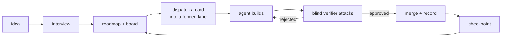

# Supertaskr

**AI agents build the wrong thing fast. Supertaskr makes them build the right thing, in parallel, with proof.**

> A product idea becomes a thoroughly planned roadmap broken into exact,
> dispatchable tasks, then governed multi-model execution of it — with the
> project folder as the complete, successor-proof record. The better
> builder models get, the more the bottleneck is knowing what to build.
> The product is the whole loop; the proof is a repository it built.
> — [docs/NORTH_STAR.md](docs/NORTH_STAR.md)

This repository is built by the method it ships. Every claim below has a
file in this folder that backs it or contradicts it. Where the two
disagree, the file wins.

---

## What it is

Three things, in the order they earn each other:

1. **A method.** A convention in plain files — cards, lanes, fences,
   verdicts, rooms, checkpoints — that any model that can read files can
   run by hand. It lives in [method/](method/) and is versioned and
   eval-gated like code.
2. **A CLI.** `npx supertaskr` runs the loop: interview an idea into a
   board, dispatch a card into an isolated lane, verify it blind, merge it
   with a record, undo it safely. Every verb fronts a script this repo
   already runs on itself, and a verb can never make a red gate look green.
3. **An app.** A local desktop mirror of the folder: the story map, the
   board, the lanes off git, the architecture map with drift, blast radius
   and churn — all rendered live off files. It spawns nothing. It shows.

No accounts. No cloud. No telemetry. Never in your inference billing path.
You bring the agents you already have.

---

## Why it hits different

**It starts with a conversation, not a form.** Seven questions turn an
idea into the five governing documents and the first dispatchable cards.
Thirty minutes from "I have an idea" to a board an agent can start on.
Weak answers get challenged, not transcribed, and the interview gets
sharper every time it runs.

**Parallel by construction, not by hope.** Every card declares the files it
will touch. Every lane gets its own branch, worktree and write hook. Two
lanes can only run at once when their write sets are proved disjoint, and
the proof is computed over the expanded paths, not the component names.
Four, five, six agents on one repository, zero collisions, no merge hell.

**Verified blind.** The verifier is handed the card and the diff. Never the
builder's reasoning. It writes its attack plan before the diff exists, then
plants mutants to prove the tests actually bite. A green that was never
seen red is not evidence here. Shared assumptions are the failure mode;
blindness is the guarantee.

**The folder is the memory.** Cards carry their criteria, the builder's
notes and every verdict beneath them. Decisions are dated records. Design
arguments are rooms with a ruling at the top. Every merge writes a
checkpoint that is never edited. A new session, or a new model, cold-starts
from files. There is no chat history to lose.

**Derive it, never quote it.** A number lands in prose only where a program
re-derives it. The behaviour census is generated from test names, so a
sentence in it is false the moment its test reds and nobody keeps it true
by hand. Documents that lie go red.

---

## How your day changes

| before | after |
|---|---|
| one mega-session that forgets what it built | one card, one lane, one verdict, one record |
| "did the agent actually test that?" | a mutant drill that had to fail before it was allowed to pass |
| agents stepping on each other's files | fences proved disjoint before dispatch |
| a plan in a chat window, gone tomorrow | a board and a roadmap that live in the repo |
| you are the integration bottleneck | the merge ritual runs the gates and stops with the diff staged for you |
| rediscovering yesterday's decisions | a room with the argument and the ruling, dated |

---

## The loop

Every arrow is a file you can read afterwards.

---

## Features

The ruling page is [docs/VERSIONS.md](docs/VERSIONS.md). This list
transcribes it; where they disagree, that page is right.

### v1 — one developer, the whole loop, on their own project

- **The method**, versioned and eval-gated, installable into any folder.
- **The interview**: seven questions to the five governing docs, the first
  cards and a board. One interview in two lenses: a slash command in your
  agent app, and the app's split view.
- **The board**: a story map live off files, a detail panel, lanes read
  straight from git, every disposition with its reason.
- **Dispatch**: a dispatch view that derives what can start now, a brief
  that is a contract, a fence enforced at the write, a preflight that
  refuses a bad card, blind verification as a property of the spawn, and
  one command to arm a lane.
- **The seat skill**: the architect's hand work as a slash command over
  the CLI. This is how v1 is driven.
- **`npx supertaskr`**: the scripts and the indexer behind both skills.
  Safe undo included: revert a card's merge with a dependency check.
- **The map**: architecture and tasks lenses, intent versus reality, drift,
  cycles, blast radius, churn, and a byte budget with a measured reason.
- **Security at the write**: a dependency-legitimacy gate, an injection scan
  on every docs write, a secret read guard in the fence hook.
- **Gates with names**: pre-flight, revision, escalation, abort. A TODO an
  agent adds must cite a card or the landing is refused.
- **The quick path**: one line files a small card with a light review and
  lands it with a verdict. Guard-class changes are refused the shortcut.
- **A test named per SHALL clause**, and an interview that asks each card
  its edges and its must-nots and writes the kept ones as criteria.
- **Two decision modes**: `audit`, where an unanswered decision blocks
  dispatch with your name on the choice, and `auto`, where the planner's
  defaults are stamped and visible.
- **The commission list**: the verifier enumerates every side effect the
  diff adds and maps each to a criterion. Unmapped is a finding.
- **The rooms lens** in the app: every design argument with its status
  and its ruling, read-only, live.
- **The launcher**: one command boots your app worktree fresh.

### v2 — teams and depth

- **Stage slots**: named extension points at every stage of the loop.
- **Environment tiers and rehearsed rollback**, for when services ship.
- **Fleet fences**: the fence system across machines.
- **Competitive execution**: the same card, two models, a blinded judge.
- **The cockpit**: an in-app orchestrator conversation, only on evidence
  a user wants it.
- **More seats**: plan checker, design mock-up, UAT walk, browser QA,
  security audit, reviewer consensus.
- **Ship, deploy and canary** under the environment tiers.
- **Dashboards** for preflight, economics and the health bands.
- **Calibration**: effort estimates with an actuals loop, a reversibility
  rating per card, complexity-triggered refactors as a health band.
- **The version table**, and catalogue-generated negative tests.

### v3+ — the horizon

- **Purpose-drift signal** and scope-reduction detection with re-injection.
- **Counterfactual policy replay**: what would the loop have done under a
  different rule.
- **Compliance for free**: the record is the audit trail.
- **The self-confessing eval corpus** and **method SemVer with a method
  marketplace**.
- **Rooms and standing presence**, **retroactive verification**,
  **session ghosts**, **counterfactual gardens**, **dream lanes**,
  **intent compilation**, **the proof economy**, **the method breeds**.
- **Time machine**, truth maintenance beyond the drift slice, production
  feedback, synthetic users.

---

## Built with itself

- [docs/tasks/](docs/tasks/) — every card, with the verdicts appended
  beneath the criteria, including the ones that were **rejected** and
  why.
- [docs/checkpoints/](docs/checkpoints/) — one record per merge, written
  once, never edited: the gates fired, the suites with their exits.
- [docs/rooms/](docs/rooms/) — the arguments, in writing, with the ruling
  at the top.
- [docs/decisions/](docs/decisions/) — every architectural decision as a
  dated record naming where it was decided.
- [docs/CAPABILITIES.md](docs/CAPABILITIES.md) — what the app does, one
  sentence per behaviour, generated from the end-to-end test names.

---

## The house terms

| here | the standard name | where the rule lives |
|---|---|---|
| **card** | the work item, kept in-repo as the spec | [method/tasks/TASK-FORMAT.md](method/tasks/TASK-FORMAT.md) |
| **lane** | branch isolation: one task, one branch, one worktree, one session | [method/lane-protocol.md](method/lane-protocol.md) |
| **fence** | computed write-set disjointness | [method/lane-protocol.md](method/lane-protocol.md), rule 5 |
| **seat** | a role, adversarially separated by what it may read | [method/roles/verifier.md](method/roles/verifier.md) |
| **room** | a design discussion in a file, closer to an RFC than a thread | [method/rooms/ROOM-FORMAT.md](method/rooms/ROOM-FORMAT.md) |
| **poison drill** | mutation testing, run as a hand discipline | [docs/CONVENTIONS.md](docs/CONVENTIONS.md) |
| **checkpoint** | the integration log entry, append-only | [ADR-019](docs/decisions/019-governing-docs-rules-truths-records.md) |

---

## Where the rules live

- [docs/NORTH_STAR.md](docs/NORTH_STAR.md) — the vision, the first user, the bar.
- [docs/STATE.md](docs/STATE.md) — what is happening right now.
- [docs/ROADMAP.md](docs/ROADMAP.md) — what the app does per feature, and what comes next.
- [docs/ARCHITECTURE.md](docs/ARCHITECTURE.md) — which components exist and the rules between them.
- [docs/CONVENTIONS.md](docs/CONVENTIONS.md) — how to work here, including every build and test command.
- [method/README.md](method/README.md) — the convention itself.

`CLAUDE.md` and `AGENTS.md` beside this file are doors for agent sessions.
This file is the door for people.

Build and test commands are not repeated here on purpose. They live in
`docs/CONVENTIONS.md`, where a test derives the CI workflow from them and
fails when the two drift. `node tools/e2e/bin/supertaskr.mjs --help`
prints the verbs at your own ref.

---

## Status

Not published yet. The package proves itself by packing and installing
into a project that is not this one, on every suite run. Supertaskr
building Supertaskr is the experiment, and the git history is the result
so far. Read [docs/ROADMAP.md](docs/ROADMAP.md) for where it stands today.
