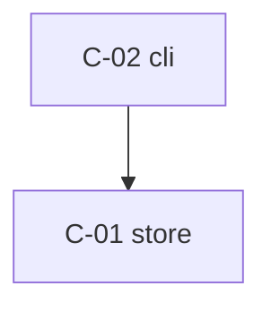

# Architecture

## System map

## Components

| ID | Component | Responsibility | Depends on | Status |
|----|-----------|----------------|------------|--------|
| C-01 | store | append + parse the plain-text log | — | planned |
| C-02 | cli | arg parsing, `done`/`week` subcommands, rendering | C-01 | planned |

<!-- Status: planned / built / verified. The dashboard colors the map from
     this column plus the tasks that reference each component. -->

## Interfaces
- Store line format: `YYYY-MM-DD<TAB><habit>` + newline, one line per
  habit per date, append-only. Skipping of malformed lines is C-01's
  job alone (T-003) — C-02 never sees raw lines.
- Store path: `$HOME/.streak/log`; `$STREAK_FILE` overrides when set
  (the test seam — no test touches the real store).
- Weeks start Monday (ISO 8601). All date math is local time.
- Exit codes: 0 success/empty, 1 I/O or encoding failure, 2 bad user
  input. stderr for diagnostics only; stdout is product output only.

## Related decisions
- decisions/001-stack.md — Rust, stdlib-only, single static binary.
