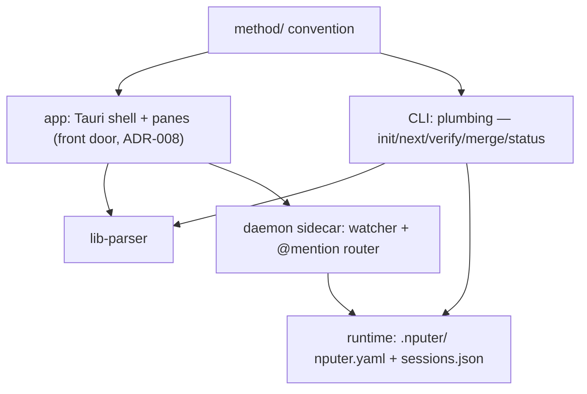

# Architecture

## System map

## Components
| ID | Component | Responsibility | Depends on | Status |
|----|-----------|----------------|------------|--------|
| C-01 | method/ | The convention: templates, formats, roles, interviews | — | built (v0.1.5) |
| C-02 | CLI | Plumbing + power/CI path (ADR-008): genesis, dispatch; shells out to agent CLIs | C-01, C-06 | planned |
| C-03 | Runtime | nputer.yaml role defaults; sessions.json registry | C-02 | planned |
| C-04 | Daemon | Sidecar: watcher, websocket, @mention → headless turns | C-02, C-03 | planned |
| C-05 | App | Front door (ADR-008): Tauri shell + panes over files; hosts the milestone-1 watcher (T-003); see docs/design/dashboard.md | C-01, C-06; C-07 when F-06 lands | building (board + map panes complete T-001…T-012; T-026 landed the genesis front door and the full-bleed `genesis` screen, and T-037 mounted C-13's lens inside it — the screen renders the pane on the watched `DocsModelState`, behind an error boundary, so hand-driven genesis renders live; T-025 registered C-14's four genesis commands + the exit-reap hook in lib.rs, so the shell can now spawn the planner although nothing in the UI calls it yet; T-049 moved the app's keyboard surface out of a component and up to the root — `components/shell/accelerators.ts` holds a pure chord table and ONE window listener mounted by `App`, replacing the front-door-scoped one, so ⌘O/⌘N fire from every screen — and gave the board header its own "Start an interview", so genesis is reachable from an open project and not only from the front door; T-050 made the startup handshake RECOVERABLE — the `docs-changed` subscribe + `docs_snapshot` pull that C-10 delivers is latched on the in-flight PROMISE rather than a boolean set before the awaits, so a refused boundary call no longer strands the app permanently, the rejection becomes shell state and is rendered as text, and the startup screen carries retry + the front door's own two ways in, which means no reachable screen is a dead end; T-034 gave the map pane its SECOND lens — a segmented control (architecture · tasks) where tasks lays the board's cards out in dependency waves over `blocked_by`, with a critical path, and the architecture lens is proven byte-unchanged beside it (the whole `map-view` delta is the 472-byte control element); T-042 made the genesis switch TRUTHFUL at the three places it was claiming more than it knew — the outcome now carries the docs tree it found (so the screen stops saying "nothing written yet" over a non-empty docs/), a watch-state transition is ONE measured rule covering armed→unarmed as well as unarmed→armed instead of two special cases, and the `model-updated` echo reads PROVENANCE (`outcomeCarriesSnapshot`) instead of a seq guard that was always true; T-027 turned the `genesis` SCREEN into a SPLIT VIEW and made C-05 the first caller of C-14 — `GenesisScreen.tsx` now lays a 640px chat column (C-13's `InterviewChat`) beside the lens above 1024px CSS px and centres the chat alone below it, `App.tsx` starts C-13's turn subscription at the root, and the screen owns a scoped accelerator table entry (⌘. cancels) on T-049's single window listener rather than a second one. The shell adds no reducer: the turn stream stays C-14's and the chat renders `turn.text` as the store folds it; T-051 then made that split the size the app actually opens at — `tauri.conf.json`'s window block goes 800×600 with no floor to **1280×840 with minWidth 1024 / minHeight 700**, the FIRST window minimum this shell has ever declared, so the sub-1024 "chat alone" branch above is now outside the window's legal range rather than its default (1280 is the unique width at which the two halves are equal; 700 was justified as clearing every screen's natural content at the minimum, the repo map's 692 being the tallest, by 8px — **and THAT JUSTIFICATION IS FALSE, corrected at T-062 (T-062-s1)**: the probe read the DOCUMENT, which reports content only for a screen that can push the page open, so it recorded 302 for the bounded genesis screen whose real content is 1082 and could not see the board's 4989 either. 700 SURVIVES, on the property T-062 creates rather than the one T-051 claimed — every screen owns a scroll region, and the tightest non-form region at the declared minimum is 580px against T-048-s5's 250px floor). The whole change is four manifest keys: no grant, no Rust, no frontend edit; T-028 then made the split's right half CHANGE HANDS — `GenesisScreen.tsx` picks its renderer (`showsBoard(docs) ? "board" : "lens"`) so the lens becomes C-08's real board the moment a task file PARSES, and the completion panel's one CTA is the FIRST path this shell has ever had from a genesis session into the project board (`openBoardFromGenesis`, a pure phase move; no dispatch affordance, F-04 still fenced). Zero new IPC — the command set was still exactly nine — and zero telemetry; T-029 then registered C-14's FOUR new genesis commands in the same handler (`genesis_resume`, `genesis_fresh`, `genesis_transcript`, `genesis_kickoff`), taking the app's whole IPC surface from NINE to **THIRTEEN** — derived from both ends and intersected: 13 `#[tauri::command]` and 13 in `generate_handler!`, against 10 literal `invoke` call sites plus `runPicker`'s three. All four are ZERO-ARGUMENT (`tauri::State` extractors only), which is ADR-012's "narrowness lives in the command's own signature" applied rather than cited — no path, no session id and no flag crosses the boundary in either direction, and the 92-grant `core:default` set is byte-identical (`acl_pin.rs` sha256 `8d24cbad…` at the base and at the tip); T-063 then gave the shell its SECOND webview→process event and its first OUTBOUND FAILURE channel — `recordStartupFailure` used to end at a `console.error` no WKWebView ever surfaces to stdout, and now emits `startup-failed`, which `lib.rs` listens for and writes to **stderr** through a pure `startup_failed_line` (control bytes escaped, capped at `MAX_ECHO_LOG_CHARS` = 800 with an explicit `…(truncated)` marker, so the cap never lies by omission; the whole line is 58 + 800 + 12 = **870 characters / 872 bytes** once the cap fires, content-independent). The stream choice is the architectural half: `model-updated` goes to stdout and this goes to stderr, so a healthy round trip and a failure are separable in one session's log WITHOUT parsing. **NO NEW IPC COMMAND AND NO NEW GRANT — an event is not a command**: `generate_handler!` is byte-identical across the merge (still THIRTEEN, sha `4e062a2e…`) and `acl_pin.rs` is a 0-file diff at the same 92-grant `8d24cbad…`. The startup phase also gained a DEADLINE (`STARTUP_DEADLINE_MS` = 8 000, pinned by its own assertion because a test parametrised by a constant cannot pin it), which is what makes a HANG distinguishable from a REJECTION — the failure state T-050 introduced could previously only be reached by something actually rejecting; T-062 then settled what the shell IS, which had been two things since T-048: the column was `h-screen` for genesis and `min-h-screen` for everything else, with the fork explicitly deferred to T-027 and never taken. **ONE SCROLL MODEL NOW** — `main` and the column are `h-screen` unconditionally, `PaneRail` carries its own, the `boundedFrame` conditional and its `cn` import are gone, and **the page never grows on any screen** (measured: page == viewport on all five screens at 1280×840, 1024×700 and 800×600, 15 of 15). The corollary is the load-bearing half: a bounded frame makes overflow the SCREEN's problem, so every screen had to gain its own scroll region — the front door's card, `board-scroll`, the map canvas and the genesis lens — and the app chrome (wordmark, project path, parse chips, theme toggle, rail) stops being scrollable content. **The trap this closes was already in the tree and silent**: `MapView`'s canvas was `min-h-0 flex-1 overflow-hidden`, a box that can shrink and, when it does, HIDES what no longer fits — harmless only while the column could grow, and worth 54px of unreachable graph at 800×600 the moment it could not, with every suite green. It is now `overflow-auto`, and the lane asserts the CLASS (no box may clip content it gives no way to reach) rather than the instance. **Zero IPC movement and zero grant movement — this merge is `app/src/**` only**: `app/src-tauri/**` is a 0-file diff, `generate_handler!` untouched at THIRTEEN, `acl_pin.rs` a 0-file diff at the same 92-grant `8d24cbad…`. Zero new tokens; the built stylesheet's content hash moves only because Tailwind emits a different UTILITY set. **T-066 closes T-062-s3 without moving the strip.** `parse-error-details` remains outside `board-scroll`, so ordinary diagnostics stay visible while the board moves, but `max-h-48 overflow-y-auto` makes the list itself the overflow owner above 192px. Sixty real parser failures now leave page==viewport and keep the board at 524/384/284px across 1280×840, 1024×700 and 800×600; every diagnostic remains reachable. No token, parser, IPC, grant, manifest or Rust surface moved, and the graph relation/finding fixtures remain unchanged; T-073 restored the one architectural guard in this component that is not code at all — **THE SHELL NOW COMPILES AS TWO PROGRAMS, NOT ONE**, and that is the whole change. `app/tsconfig.json` read `"include": ["src", "test"]`, so `app/test/node-builtins.d.ts` — the file that exists precisely BECAUSE the app ships no `@types/node`, so that a webview module reaching for a node builtin fails `tsc` by construction — was visible to `app/src`. T-028 had legitimately extended it with `mkdtempSync`/`mkdirSync`/`writeFileSync`/`rmSync` and `node:os`'s `tmpdir` for its own temp-project writes, and the side effect was that ADR-017's free half (the spawned planner writes; the app renders what lands) had quietly stopped being enforced: a four-line probe under `app/src` importing `mkdirSync`/`writeFileSync` typechecked at **exit 0** on the base. **A FILE BOUNDARY CANNOT FIX THIS AND THE CARD'S OWN SECOND OPTION WAS REFUTED BY MEASUREMENT**: ambient module declarations merge PROGRAM-WIDE, so a `declare module "node:fs"` block written inside the single test that writes still let the `app/src` probe compile at exit 0, and a module file can AUGMENT an ambient module but never CREATE one (TS2664 for `node:os`). The write surface therefore moved out whole, into `app/test/node-builtins-write.d.ts`, reached only by a second program — `app/tsconfig.test.json`, which is `extends` plus a wider `include` and nothing else, so the two programs cannot drift in any compiler OPTION — while `app/tsconfig.json` narrows to `["src", "test/node-builtins.d.ts"]`, naming the read-only surface one path at a time so the guard is legible in the config. `npm run build` becomes `tsc && tsc -p tsconfig.test.json && vite build`, and that second `tsc` is load-bearing rather than tidy: measured with a real planted type error, the bare app program exits 0 (misses it) and `vitest` exits 0 (it transpiles without typechecking), so **without that one line nothing in the repo would typecheck any of the 42 test files**. The guard's scope is stated rather than implied: the TEST program necessarily contains `app/src` too — the tests import it — so the restored property is exactly "**the program `npm run build` gates on denies the write**", which is also the program CI runs; the residual is filed as `T-073-s2` rather than papered over. The second, independent closer is the `crescendo-dom.test.tsx` sink sweep, widened from `app/src/genesis/` to ALL of `app/src` on ONE shared `frontendFiles()` walk with the IPC census beside it — **8 files → 47 across 9 directories** — and the two closers are not alternatives: on one probe the type gate reds at exit 2 while the pre-T-073 sweep replayed verbatim over the identical tree reports `files=8 hits=0`. **ZERO BEHAVIOUR CHANGE, and it is the strong form**: `app/src` is byte-identical (53/53), no bundle input moved, and a HEAD build against a build with the base `tsconfig.json` swapped in reports `diff -r` DIRECTORIES IDENTICAL. **WHAT IS NOT HELD IS THAT IT STAYS TRUE.** The card built a third pin beyond its criteria, on the correct instinct that a restoration nothing holds is no restoration, and the verifier measured two ways past it: the include half is a FIRST-MATCH REGEX over raw text (not, as the card and the test comment both claim, parsed out of the JSON), so widening the line while leaving the old value in an explanatory comment passes 14/14 with the guard gone; and a single `/// <reference path="./node-builtins-write.d.ts" />` at the top of the shared ambient file puts the writes back in the app program with every pinned fact untouched — 827/827 green with `rmSync(dir, {recursive:true, force:true})` live in `app/src`, which the sweep cannot catch because `rmSync` matches none of the eleven sink strings. `T-073-s4`/`T-073-s5` carry it, with the measured fix: assert the PROGRAM (`tsc --noEmit --listFiles`) instead of a proxy for it; **T-064 finished the job T-042 started at the genesis switch** — see the Genesis bullet under Interfaces for the whole account. Three things move in C-05's own code: `reducePickOutcome` stops discarding an overtaking `docs-changed` emit when it is a FRESHER reading of the SAME folder (`genesisSwitchIsOvertaken`, on `prev.docs.projectDir` — the criterion's literal `switched.projectDir` conjunct is UNSATISFIABLE, since `resetDocsForProjectSwitch` sets that field to `""` and a canonicalized `project_dir` is never empty, so a literal implementation would have been a constant-false guard and arm (b) a no-op); the snapshot-less arm's watermark becomes a `Math.max` and can no longer walk backwards (measured 8 -> 7 before); and `ShellState` gains **`watcherLive`**, which closes T-063-s3 by arm (b) — the subscribe failure's consequence clause (*"no file change can reach the board"*) is now derived from whether a `docs-changed` subscription is HELD rather than from the step's name, so a refused RE-subscribe that left attempt 1's live handler attached stops telling the user the app cannot recover on its own. The residual is filed (`T-064-s3`): the flag's meaning is coupled to `startupFailure` by a doc comment and by there being exactly one writer, not by the type; rooms/sessions pending F-05; **T-013 gave the shell its SECOND SUBPROCESS SURFACE and its FOURTEENTH command** — `app/src-tauri/src/churn.rs` shells out to `git` behind the zero-argument `repo_churn`, taking the IPC census from THIRTEEN to **FOURTEEN**, derived from both ends and intersected (14 line-anchored `#[tauri::command]`, 14 `generate_handler!` entries, name-for-name identical) with **ZERO new webview grants** — `acl_pin.rs` is a 0-file diff at the same 92-grant `8d24cbad…`, which is ADR-012 applied rather than reopened, since an app command is not a grant. **The security content is WHICH BINARY RUNS, and the first build got it wrong**: `Command::new("git")` plus `current_dir(root)` with an inherited PATH let the child `chdir` into the opened project and only THEN resolve a bare name, so a relative or empty PATH element resolved `<project>/git` — the verifier planted a fake and **the app executed it**, which is strictly worse than the case T-060 fixed because the opened folder is the one directory an attacker controls by asking the user to clone a repository. The fix does not write a second gate: `runner.rs`'s `validate_resolved_binary(path, adapter)` becomes a thin wrapper over a new **`validate_resolved_program(path, name)`**, so the resolved-path standard has ONE implementation and TWO callers (the `claude` door and the `git` door), `login_shell()` is made `pub` and shared, and `run_git` spawns the ABSOLUTE resolved program with the child's `PATH` SET by the app from an absolute-only, traversal-free list. That refactor is the reason C-14 is in this card's fence at all, and it is behaviour-preserving for its original caller by TEXT rather than by sample — the two gate bodies are byte-identical under the rename (35 lines, `diff` exit 0, re-derived at the merge against `11c82a1`) |
| C-06 | lib-parser | Pure library: docs/tasks/ + ROADMAP backbone → typed model (T-002); browser-safe pure exports (T-003); component files (T-008); cross-ref validation (T-019); strictness pass (T-030 — the backbone scanner strips HTML comments before matching, so a commented row is neither a phantom feature nor a dropped one; blocked_by cycles reported once per SCC; three new issue kinds, additive, consumed generically); id-space aliasing lifted OUT of the component registry and applied to all three id spaces (T-053, promoting T-030-s3 — `id-slot.ts` holds the numeric-slot grouping ONCE and component.ts, validate.ts and roadmap.ts each own only their message, because copied logic in three id spaces is three chances to disagree about what an id is. `C-05`/`C-005`, `T-01`/`T-001` and `F-1`/`F-01` are each one slot spelled twice, and nothing rejected the pair before: the strings differ, so `duplicate-id` correctly stayed silent while every consumer reasoning NUMERICALLY resolved the tie by an accident of zero-padding. Two properties are load-bearing — the strip is TEXTUAL and never `Number()`, so two genuinely different ids past 2^53 cannot false-alias when floating point runs out of room; and every digit run is canonicalized separately with its separators kept, so a task's `-sN` suffix aliases like any other digits while the `-s` keeps a suggestion apart from its parent. `aliased-id` gained a REQUIRED `space` field rather than splitting into three kinds — the shape `dangling-reference` and `duplicate-id` already use, and the one that breaks the compiler at a construction site instead of falling silently through an exhaustive switch. Zero app-side change: the app surfaces the new issues through the existing count, which is a premise the task VERIFIED rather than assumed); one shared inert-span pass now defines the structural view for BOTH roadmap rows and task headings (T-055, absorbing T-030-s2/s4/s5 — `inert-spans.ts` position-preservingly blanks top-level backtick/tilde fences, HTML comments including the abrupt empty forms, and physical-line-local single-backtick spans before either consumer matches. Recognition order keeps comment-looking bytes inside code inert; genuine unterminated comments and fences run through EOF. This is deliberately not a Markdown parser: indented code, other HTML blocks, link definitions and container/list de-indentation remain named non-goals. All 127 live section objects stayed byte-identical, while fenced roadmap examples and commented task headings became structurally inert); the id layer is now TOTAL, which is the property T-053's entry above already claimed for half of it (T-076, absorbing T-053-s2/s3/s4 — that entry states as load-bearing that "the strip is TEXTUAL and never `Number()`", and it was, in `idSlotKey`. One function away `compareComponentIds` still returned `Number(na) - Number(nb)`, so past roughly 309 digits both sides are `Infinity`, the difference is `NaN`, and `NaN !== 0` is TRUE — the comparator RETURNED `NaN` before its string fallback could run. That degraded in TWO ways, not one: at the sort V8 left the pair in arrival order, and at the `ambiguous-mapping` site `compareComponentIds(...) || fileCompare` swallowed the falsy `NaN`, so the declared winner was decided by FILE PATH — deterministic and wrong. Both were reproduced at the branch point through the real parser and both are closed: `compareDigitRuns` over `canonicalDigits` is the same textual primitive `idSlotKey` uses, so the comparator and the slot key now agree about what the digits of an id are BY CONSTRUCTION rather than by coincidence, and order is unchanged over an exhaustive 1,210,000-pair sweep of every 2- and 3-digit `C-` id. `duplicate-id` gained the required `space` field at all four emit sites, matching what `aliased-id` got at T-053, so no kind in this union still needs its prose read to know which id space it came from except `dangling-reference`; `dangling-reference` itself gained a NEAR-MISS HINT — structured `nearMiss?: string[]` plus a message clause — at all three sites, so a `blocked_by: [T-01]` beside a declared `T-001` names the id it almost matched instead of only denying it exists. NONE OF IT IS LIVE ON THIS TREE and that is stated rather than implied: the registry stops at `C-14`, no app SOURCE reads either kind — `validateProject` has zero call sites under `app/src/`, and the board's parse-error strip carries per-FILE failures only — so this is a totality fix, not an incident response, and it earns no ROADMAP narrative for the same reason T-019, T-030 and T-053 did not) | C-01 | verified |
| C-07 | nputer-index | Rust crate + a REAL binary since T-014: code → docs/architecture/graph.json (tree-sitter TS/JS/Rust); deterministic, no tauri dependency (ADR-014/015). The binary now gates and reads as well as writes — `index [--root .]`, `index --check` (writes nothing; exits non-zero on a stale graph and prints WHAT moved), `index --watch` (headless, debounced 250 ms), `arch` and `arch drift [--fail-on undeclared\|unmapped\|any]` (read the COMMITTED graph, one record per line) — on ONE exit-code contract shared with `npm run boot:check`: 0 clean · 1 the gate's verdict · 2 called wrong · 3 could not run, so "stale" and "could not tell you" are never the same number. `arch`/`arch drift` carry a NARROW reality-side join in Rust; see ADR-015's dated addendum for what that may do and where it can still disagree. F-06 | — | building (TS/JS extraction + committed graph done T-009; the binary, `--check`, `--watch` and the arch reports done T-014; Rust language extraction T-010 still open — milestone 4) |

Task `touches:` slugs map here: `app-shell` = C-05 shell/window/watcher
plumbing · `app-board` = C-05 board pane · `app-map` = C-05 map pane
(F-06) · `app-interview` = C-13 genesis pane (F-03) · `app-agent` =
C-14 agent runner (F-03) · `lib-parser` = C-06 · `crate-index` = C-07.

Component intent files: docs/architecture/components/ (same
C-namespace, one file per mapped component; parsed by C-06 — T-008,
ADR-014/015).

## Interfaces
- Everything coordinates through files; no component holds project
  state the files don't. Killing anything is safe by construction.
- CLI ↔ agents: spawn/resume the user's own agent CLIs with role
  prompts from method/roles/; never call model APIs directly.
- App ↔ project: read-only first; writes are single-field
  frontmatter edits or thread appends, nothing else (pure-lens rule).
- Genesis: the spawned planner session is the writer; the app renders
  what lands (ADR-017); app-side writes confined to .nputer/ runtime
  files. **HALF OF THAT RULE IS ENFORCED BY THE TYPE SYSTEM RATHER
  THAN BY REVIEW, and since T-073 it is enforced again**: the app
  ships no `@types/node` on purpose, so a webview module reaching
  for a node builtin fails `tsc` by construction. `app/test/
  node-builtins.d.ts` declares the narrow surface the tests need,
  and it was READ-ONLY until T-028 legitimately added
  `mkdtempSync`/`mkdirSync`/`writeFileSync`/`rmSync` for its own
  temp-project writes — which, because `app/tsconfig.json` included
  all of `test/`, silently declared them for `app/src` too. T-073
  split the WRITE half into `app/test/node-builtins-write.d.ts` and
  put it behind a second PROGRAM (`app/tsconfig.test.json`); see
  C-05's row for why a program boundary is the only boundary that
  works here. Entry is two zero-argument Tauri commands (T-026, the ADR-012
  pattern — the native dialog opens Rust-side and no path crosses IPC
  in either direction); a folder that already holds a plan is routed to
  the ordinary open, so no overwrite path exists by construction. "No
  plan" is a WEAKER condition than "no docs/", and since T-042 the
  switch says so rather than assuming the strong one: a genesis folder
  may already hold a plain `docs/` — a lone `docs/ARCHITECTURE.md`, a
  `docs/decisions/` tree, any repo whose docs/ predates nputer — and
  when it does the ordinary recursive watch arms over it and the
  outcome CARRIES that tree, as an optional `DocsSnapshot` stamped with
  the switch's own `seq`, so the pane renders what is actually there
  instead of claiming nothing is written. `None` means the folder
  genuinely has no docs/ yet — the one shape the variant used to
  assume. Nothing new crosses the boundary: it is the same snapshot
  type, collector and containment rules the `docs-changed` channel has
  carried since T-003, on a second carrier. The tree is collected AFTER
  the arming rendezvous acks, and that ORDER is load-bearing rather
  than incidental (`open_as_project`'s own rule since T-007): arming
  resets the emit baseline to the tree it saw, so a snapshot read
  before the arm would miss a file written in the gap, and that file —
  present in the baseline, absent from the snapshot — would collect
  equal and stay suppressed until the next unrelated change. The
  arming thread reports whether a plain `docs/` armed, because it is
  the only place that knows for certain; the caller does not re-stat
  and guess across the validate→arm window.
  **SINCE T-064 THE SWITCH TELLS ONE STORY, and the sentence three
  clauses up — "a folder that already holds a plan is routed to the
  ordinary open" — is true at BOTH moments rather than only at the
  first.** T-042 gave the outcome a tree; it left the switch holding
  TWO readings of one folder taken at different times. `probe_plan`
  runs BEFORE the rendezvous, because its answer decides whether
  genesis may be offered at all; the snapshot is collected AFTER the
  ack for the baseline reason above, and between them sits a channel
  round trip bounded only by `REARM_TIMEOUT` (10 s). Write
  `docs/ROADMAP.md` into the folder in that window and the two
  readings disagreed — and both rode the payload, so the app put the
  interview screen over a folder that now had a plan: T-026's
  criterion 5 defeated by timing rather than by routing. Now
  `has_plan` is ONE predicate with TWO constructors and the LATER
  reading wins: the post-ack re-read is **veto-only** (it is reached
  only where the probe already said "no plan", so it can turn genesis
  OFF and never ON) and its verdict is `open_as_project`'s own
  outcome, which needs no further work because the two paths have
  already converged — project committed, docs watch armed
  recursively, sentinel armed, seq taken, candidate cleared. What is
  NOT closed is the window itself: a plan written after the switch
  returns is still a plan written after the switch returns, and the
  sentinel brings the pipeline up correctly either way.
  **THE WIRE NARROWED WITH IT**: `PickOutcome::Genesis` no longer
  carries `probe` — measured at ZERO live readers under `app/src` at
  both endpoints, so the field was a decision record nothing read —
  and dropping it is boundary-narrowing in ADR-012's direction. No
  command was added or removed (IPC is still THIRTEEN at both ends)
  and `acl_pin.rs` is a 0-file diff at the same 92-grant
  `8d24cbad…`. On the shell's side the switch also stopped throwing
  away a fresher measurement of the SAME folder — an emit that
  overtakes the invoke reply is kept when `prev.docs.projectDir`
  matches the outcome's, because a watcher emit is a FULL snapshot and
  Rust's seq counter is global and monotonic, so an equal folder with
  a not-lower seq can only be a strictly later reading; a different
  folder still clears, and the snapshot-less arm's watermark can no
  longer walk backwards. The
  rendering half is real since T-037: the `genesis` screen hands its
  live `DocsModelState` straight to C-13's pane, so the lens updates on
  C-10's existing watcher path — no new IPC, no polling, no prop
  plumbing. The pane is on the shell's critical path, so the mount
  wraps it in an error boundary that does NOT latch (it resets on the
  next snapshot's seq): a throwing pane degrades to a read-only notice
  inside the slot and cannot take the window down. The SPAWNING half is
  real since T-025 (C-14): four app commands — `genesis_start`,
  `genesis_send_turn(text)`, `genesis_status`, `genesis_cancel` — over
  one `genesis-turn` event channel, still exactly `core:default` (the
  92-grant set is byte-identical; `std::process` is not a plugin).
  **T-029 took those four to EIGHT** — `genesis_resume`, `genesis_fresh`,
  `genesis_transcript`, `genesis_kickoff`, every one zero-argument — and
  the addition is not more of the same: three of the four are for the
  cases where there is nothing to spawn. `genesis_kickoff` assembles the
  method kit's kickoff for a HUMAN to paste into their own terminal, so
  the runner now produces output for a person as well as for a child
  process; `genesis_fresh` deliberately does NOT ride `genesis_start`
  with a flag, because that would move a destructive selector (mark the
  user's live session dead) across the IPC boundary. The channel is
  still one and the fold is still one. One
  short-lived child per turn, resumed by the CLI's own native session
  id, cwd = the open project, argv fixed arrays and the user's text on
  stdin (never a shell string, never in argv); the child's environment
  is BUILT, not inherited — `env_clear()` plus a named allowlist, so no
  key or token can reach it (ADR-003 made mechanical). The `.nputer/`
  runtime writes are no longer planned but real and losable by charter:
  `sessions.json`, `genesis/transcript.jsonl`, and the compiled-in
  method snapshot materialized per genesis into `genesis/kit/` so the
  CLI reads it inside its own cwd scope — all outside the docs watch
  root, so they raise no snapshots. **Since T-027 the UI calls all of
  it**, and the shape of that call is the part worth recording: C-13's
  chat subscribes to the `genesis-turn` channel and invokes the four
  commands, and it adds NO second reduction — `reduceGenesisEvent`
  already coalesces deltas into `turn.text` and replaces the buffer with
  the canonical `result` on `completed`, so the chat renders what the
  store gives it and there is exactly one fold of that channel in the
  app. The BANKED CHIPS are the other half of the contract and they do
  not ride this channel at all: they are derived by diffing the docs
  snapshot C-10's watcher delivers across turn boundaries, so a chip is
  evidence that a FILE changed and can never be evidence that a model
  said so — driven with 24 hostile probes at T-027's verification,
  including turn text and activity labels naming real paths over an
  unchanged disk (zero chips) and a human writing a file mid-interview
  (an identical chip, which is ADR-006's hand-driven mode rendering
  correctly). What is STILL not true: the loop has never run against a
  real model — it is proven against a fake CLI fixture and a scripted
  lane only — and the user's half of the transcript does not survive a
  remount, because `refreshGenesisStatus` rebuilds phase/turn/session but
  never `turns` (T-029's rehydration).
- Resolving the agent CLI (disk → `execve`) — the boundary the Genesis
  bullet above does not describe. Before any turn can spawn,
  `resolve_cli` decides WHICH `claude` runs. **Since T-060 it decides
  that from a PROBE it just ran, and from nothing else.** The order is
  the test seam, then one probe, then typed `cliNotFound`; there is no
  third source and in particular there is no file.
  **`agent-paths.json` IS GONE** — T-047 gated that cache, T-060 RETIRED
  it: `CacheFile`, `CacheEntry`, `read_cache`, `write_cache`,
  `invalidate_cache`, `cache_path` and `RunnerConfig::config_dir` are
  all deleted, so the app now holds NO durable state outside `.nputer/`
  at all and the whole file→exec class stops existing rather than being
  narrowed. Three reasons, in the order established: the file's stated
  justification was already false (it existed "so the login-shell probe
  runs once per install rather than once per turn", but T-047 stopped
  caching the login PATH, so the shell was spawned on every resolve
  regardless — the cache saved nothing it claimed to); the probe returns
  the binary path and the login PATH in the SAME spawn; and the cost was
  measured — **3.7–7.8 ms, median 4.0** for the login-shell probe against
  **39–42 ms, median 40** for the `claude --version` probe the same
  resolve runs unconditionally. Retiring it also deleted
  `probe_login_path`, whose only caller was the cache-hit arm, so a
  resolve can no longer spawn the user's login shell twice.
  **ONE GATE NOW HOLDS EVERY DOOR** (T-047-s5). `validate_resolved_binary`
  — absolute, no `.`/`..` component, file name == the adapter's binary,
  executable — is applied inside `which_in` to every candidate a search
  path produces AND again to whatever the login shell's `command -v`
  printed, BEFORE `Command::new` and before the `--version` probe. T-047
  applied it only to the cached path, so the same function called
  `relbin/claude` `NotAbsolute` and discarded it while the probe arm
  EXECUTED it: `which_on_path` reads the app's inherited `PATH` and hands
  each element to `which_in`, which does `dir.join(binary)`, so a
  relative element (`.`, an empty element meaning CWD, a bare directory
  name) produced a relative binary path that the OS resolved against
  whatever CWD the app was launched with. A failure is now treated as
  "this probe found nothing": the search continues past a refused
  element, and a refused final answer falls to typed `cliNotFound` with
  a sanitized line on stderr. Nothing is executed on the way to
  refusing.
  **THE RESOLVER DOES READ THE ENVIRONMENT, and the docs now say so**
  (T-047-s4). The CHILD's environment is still built rather than
  inherited (`env_clear()` plus the allowlist — that claim is unchanged
  and still true), but the resolver reads exactly three variables of the
  APP's own environment, listed in `RunnerConfig`'s doc comment and
  pinned by a test that re-derives them from the source: `SHELL` picks
  the program run with `-l -c`, `PATH` is the fallback search list, and
  `NPUTER_NO_REAL_CLI` is the guard below. "Production reads nothing
  from the environment" was true of the CONFIG and false of the RESOLVER
  two functions away, and a reader of that pin would not have guessed
  it. **`$SHELL` is also NAME-CHECKED now** against `zsh`, `bash` and
  `sh` — the three whose `-l -c` semantics the script actually relies on,
  fish's differing — falling back to `/bin/zsh`; before T-060 any
  absolute executable named anything was run with `-l -c <script>`.
  **NO TEST CAN RESOLVE THE USER'S REAL CLI, STRUCTURALLY** (T-047-s6).
  The property used to live in a `RunnerConfig` field every test had to
  remember, with `..RunnerConfig::default()` as the idiom and the default
  `true`, **and it failed**: T-047's verifier spawned the developer's
  real `claude` with the genesis planner prompt from `cargo test`. Now
  `resolve_cli` refuses the login-shell and `which_on_path` arms whenever
  `real_cli_arms_forbidden()` says so — `NPUTER_NO_REAL_CLI=1` forbids,
  `=0` permits, and UNSET is DERIVED: forbidden iff the process is a
  cargo test binary, which cargo runs out of `<target>/<profile>/deps/`
  — or a rustdoc DOCTEST, which runs out of a `rustdoctest<random>` temp
  dir with `cfg!(test)` false and used to fail OPEN (T-060-s4, closed).
  Nothing has to be set, exported or wrapped, so a test file written next
  year inherits the refusal, doctests included. A `.cargo/config.toml`
  `[env]` entry was considered and rejected because it would have reached
  the human's DEVELOPMENT APP, which would then have stopped finding their
  CLI — and the mechanism is not the obvious one (T-060-s5): `tauri dev`
  is NOT `cargo run`, it is `cargo build` plus a direct spawn with no
  cargo process in the tree, but the tauri CLI reconstructs cargo's run
  environment for the binary it spawns and `[env]` rides along, measured
  reaching the dev app against a no-cargo control. The one `#[ignore]`d,
  env-gated real smoke opts out in one line. **The proof that the guard
  refuses runs in CHILD PROCESSES** rather than by lifting the variable
  in-process (T-060-s3): a lift window in a binary libtest runs on many
  threads made the guard's own tripwire red at CI's thread count.
  A turn is still not one process: the turn's own child is exactly one,
  and the resolve ahead of it spawns a login shell and a version probe.
  **ONE honest residual remains**, recorded in the validator's own
  header: the gate checks SHAPE and never IDENTITY, so an absolute,
  traversal-free file named `claude` pointing at an attacker's binary
  still passes — there is no `canonicalize`, so a symlink or a swapped
  file is enough and no race is needed. Its precondition is write access
  to a directory already on the user's PATH. T-047's second residual —
  the freshly-probed path being exempt from the gate — is CLOSED.
- Test surfaces (DEV, browser-only) — part of what the app exposes, so
  named here rather than left to be discovered in the source. THREE
  harnesses hang off `window` in a browser DEV build since T-027 added
  `__nputerInterviewHarness` (it feeds `genesis-turn` events to the chat,
  which a served bundle cannot otherwise reach because there is no Tauri,
  therefore no runner and no CLI). It sits behind the SAME single gate as
  the two below — `!isTauri && import.meta.env.DEV` — and T-027's
  verification re-derived both halves of that gate against a DEV-flipped
  build: `NODE_ENV=development npm run build` does put all three names in
  the bundle (T-041-s4's known, already-filed lever, not a T-027
  regression), and the runtime `isTauri` half still holds inside that very
  bundle, checked at the minified install site. The two older ones:
  `__nputerDocsHarness` (pre-existing — feeds docs snapshots, which in a
  browser always land on phase `open`) and, since T-041,
  `__nputerShellHarness` (`applyProjectStatus` / `applyPickOutcome` /
  `applyStartupFailure` / `getShell`), which reaches the four phases a
  served bundle otherwise could not — `noProject`, `noDocs`,
  `rejectedPick`, `genesis` — and, since T-050, one state that is NOT a
  phase: the `startupFailed` SCREEN, which rides `loading` in the
  shipped app and `browser` in a served bundle. That fourth door is
  `recordStartupFailure` itself, the module-private function the store's
  own two catches call when `listen` or `invoke` rejects, so the lane
  renders the shipped failure state rather than a lane-side imitation —
  and it closes a hole only this harness can close, because a browser
  awaits neither boundary call and so cannot fail a real startup. It
  hands out the shell's OWN reducers by reference, so the E2E lane
  drives shipped code instead of a parallel implementation. Those two sit
  behind ONE gate, not two that can drift: `!isTauri && import.meta.env.DEV`,
  the same block in `watcher-store.ts`; T-027's third installs itself from
  C-13 under the same two conditions, so the property is still one rule
  and not three. Keeping them in that module rather
  than a test-only one is deliberate and is the SMALLER surface — a
  separate module could only reach the module-private reducers and the
  live shell through NEW PRODUCTION EXPORTS on the store, which would
  exist whether or not a test imported them. This is not IPC: no Tauri
  command, no grant, nothing reachable from the packaged app, and the
  app/src export surface grew by exactly one line, an `interface` that
  is erased at build. Measured rather than asserted at T-041's merge:
  pristine main, main + T-041's picker extraction alone, and T-041's
  HEAD build to 442,052 / 442,069 / 442,069 bytes with the last two
  byte-identical, so the harness contributes ZERO bytes and its object
  provably never constructs — the whole production delta is a 17-byte
  function extraction. ONE lever is known and filed (T-041-s4):
  `--mode development` does not flip DEV, but an inherited
  `NODE_ENV=development` does, and `npm run build` is
  tauri.conf.json's `beforeBuildCommand`. The runtime `isTauri` half
  keeps the harness inert in the packaged app even then, and a bundle
  test reds on the next `npm test`.
- Code layout: `app/` = C-05 (Tauri 2 + React + Vite + Tailwind/shadcn;
  areas app-shell, app-board, app-map, and app-interview since T-024 —
  `app/src/genesis/**` is C-13's own territory inside the app package;
  T-026 mounted the shell's `genesis` SCREEN
  (`app/src/components/shell/GenesisScreen.tsx`, C-05) and T-037 mounted
  the LENS inside it — `GenesisScreen.tsx` imports `GenesisPane`, so the
  pane is in the shipped bundle and the graph carries the C-05→C-13
  source edge, both of which were measured absent before that merge.
  That import is a source dependency of the shell on a child component
  and is still UNDECLARED in the registry — deliberate, live drift the
  map shows and the architect rules on, and since T-027 it is no longer
  the only one on that pair: the shell also imports `InterviewChat` and
  `App.tsx` imports `interview-source.ts`, so C-05→C-13 carries ten file
  edges where it carried four. **T-027 also made C-13 a drift SOURCE for
  the first time** — it had been only a target — by adding two undeclared
  directions OUT of the genesis pane: C-13→C-14 (all four new modules
  read `agent-store.ts`, which is the runner's store and not the pane's)
  and C-13→C-05 (both chat components import `components/ui/button.tsx`,
  the first genesis-side use of a shared UI primitive). Neither was
  drained at the merge — an integrator regenerates, the ARCHITECT rules
  on the registry — and both are the architect's to declare or refuse.
  **T-028 changed what C-13 IS, which the earlier merges did not.** The
  pane was a bespoke LENS over the docs tree; it is now a HOST that
  chooses its own renderer — `crescendo.ts` decides on parsed task
  RECORDS and `BoardCrescendo.tsx` mounts C-08's real `Board` read-only
  (`app/src/components/board/**` is a 0-file diff). So C-13 goes from
  two outgoing drift directions to FOUR, and the two new ones are the
  structural news: **C-13→C-08**, the genesis pane depending on the
  board for the first time, and **C-13→C-06**, the pane reaching the
  PARSER directly — which is what makes the switch a parse result rather
  than a filename match, and therefore identical for a human hand-driving
  the method (ADR-006). Both are UNDECLARED and left for the architect on
  the standing reasoning. C-05→C-13 grows ten file edges to thirteen,
  and fifteen at T-029's regen — a bigger LIST on the same pair, which is
  the shape that moves no row and lights no new ring.
  **T-029 changed what C-14 IS, and left C-13 the same kind of thing it
  already was** — the distinction is worth keeping because the two look
  alike from the card. C-13 gains real affordances (a resume offer, a
  fresh-session escape, the hand-driven block, and an inline notice when
  the turn channel refused to open) but no new outgoing dependency: its
  whole relation row set is byte-unchanged at this merge, which is what
  "more of what it already is" looks like structurally. C-14 is the one
  that changed kind. It was the SPAWN surface — start a turn, resume it
  by native session id, stream deltas, kill the group on cancel. It is
  now the component that also decides what happens when there is nothing
  to spawn: it classifies WHY a turn died as a typed outcome
  (`AuthFailed { status, message }`, `ToolDenied { denials,
  terminal_reason }`, `RejectedSessionId`, `SessionIdRejected`) instead
  of relaying an exit code and a blob, it owns "an interview was running
  on <folder>" as a single fact in `.nputer/sessions.json` and nowhere
  else, it reads `SessionEntry.model` through an accessor that can refuse
  without refusing the resume, and it can assemble a kickoff for a user
  who has no supported CLI at all. **A component that serves a user with
  no child process is not the same component as a spawner.** None of this
  is visible on the map — `languages: ["ts"]` still hides
  `app/src-tauri/src/agent/**`, so C-14 renders as its one TS file — which
  is the sharpest live argument for T-010 the registry has produced;
  **T-056 changes C-13's render cost, not its source of truth.** Completed
  live turns already keep object identity through the reducer; rehydrated
  turns now keep it through a projection cached by the immutable transcript
  payload array's identity. `PlannerTurn` is memoised on that turn object and
  historical turns receive no moving stage prop. No throttle, timer, second
  fold or store source was added. The existing resume DOM suite reaches two
  more C-13 modules directly, so observed C-05→C-13 file edges move 15→17;
  no component relation or finding changes.
  **T-057 gives C-13's banking rule ONE owner.** The chat used to hold the
  whole transition in a `useEffect` — prime, advance, rebaseline on a
  project switch, merge and dedupe within a turn — while the replay tests
  hand-copied it, so a test could agree with a COPY of the rule rather than
  the rule. `interview-model.ts` now exports `observeBanking`, one pure
  `(previous, docs, turn) -> BankingObservation` transition that the shipped
  chat and the tests both call; no second banking loop remains, and the
  project-switch clause the copy never had is pinned by a test that reds
  when the clause is removed (measured here, one test, both watermark
  arms). The counterweight is recorded rather than smoothed over
  (**T-057-s2**): the baseline moved from a `useRef` into the same
  `useState` as the chips, so a snapshot that advances the seq and banks
  NOTHING now returns a fresh object and re-renders where the old code
  called no setter at all — measured `identity kept: false`, baseline seq
  1 -> 2, `chipsByTurn` identity preserved. Bounded (the added render's only
  effect is an auto-scroll write that is a no-op at the bottom), but it
  moves against T-056 immediately above, and no test on the branch can see
  it. Structurally quiet: no component relation, finding, observedCount or
  drift flag moves, and the whole graph delta is +7 symbols / +6 edges
  inside C-13 and C-05.
  **T-043 changes who is allowed to know that the child is dead.** C-14's
  description above ends "kill the group on cancel", and the mechanism
  behind that sentence had a structural problem rather than a coding one:
  exactly ONE thread owns the `Child` and may `waitpid` it, while THREE
  observers — `genesis_cancel`, the exit hook and `AgentState`'s `Drop` —
  need to know when the group is clear and own nothing. They each asked
  the only question an observer can ask alone, `kill(pid, 0)`, which is
  TRUE FOR A ZOMBIE; and since the turn's child is always our own unreaped
  child, the honest answer to that question was "alive" until the grace
  expired. The fix is an ownership relocation, not a faster poll:
  `ChildHandle` (a `Clone` handle over an `Arc<AtomicBool>`) lets the one
  owner PUBLISH its reap and the observers READ it, and early release now
  requires both that fact and an ESRCH from `killpg(pgid, 0)`. This is the
  second of the two options STATE.md's open question offered — coordinate
  with the worker, rather than hand a second child handle around — and it
  is chosen because the first is not available: a second owner is a second
  `waitpid` on the same pid. Escalation is keyed to group membership
  rather than to the clock, since a reaped pid is reusable and the pgid IS
  that pid. **No component INTERFACE in the IPC sense moved** — thirteen
  commands unchanged, `acl_pin.rs` byte-identical at 92 grants, no event,
  no dependency edge, and the graph is byte-identical because
  `languages: ["ts"]` still hides `app/src-tauri/src/agent/**`. What moved
  is the C-14→C-05 seam's TIMING contract: `lib.rs`'s exit hook completes
  in milliseconds by coordination instead of blocking on a poll that could
  not succeed, so "child processes SHALL not outlive the app" is now fast
  as well as true on every exit path the app controls. The guarantee is
  also narrowed in all four code sites to *no orphaned descendant THAT
  STAYS IN THE GROUP*: a `setsid()` descendant leaves the group and
  survives, which is a property of process groups and is measured rather
  than asserted, and a descendant sweep is a deliberate non-goal.
  **T-069 separates RELAYING from DIAGNOSING inside C-14, and that
  distinction is the architectural content.** The paragraph above says
  C-14 "classifies WHY a turn died as a typed outcome instead of relaying
  an exit code and a blob" — and the two were coupled in a way nobody had
  written down: everything the classifier DECLINED to claim was also
  relayed nowhere. A `result` line carrying `permission_denials` with
  `is_error: false` fell through T-029-s7's deliberately narrow
  `ToolDenied` guard (correctly — a cumulative record of what was refused
  is not a statement that a refusal ended the turn), and because
  `is_error: false` also kept the result TEXT out of the diagnostic ring,
  the turn arrived as `ExitNonZero { code: Some(1), stderr_tail: "" }`
  and C-05 rendered no detail at all. The names were parsed, bounded and
  control-stripped, and went nowhere a user could see. The ring now
  carries them unconditionally, on the precedent the file already had —
  the `api_retry` note, a diagnostic the classifier never acts on. **The
  ring is a diagnostic ring, not a claim**, and the two decisions are
  independent from here on. The auth arm gains the mirror-image
  refinement: `AuthFailed` can now be WITHDRAWN by evidence, not only
  asserted by it. A turn that writes no terminal `result` line has no
  verdict to clear a status with, so a 401 the CLI retried and got past
  used to survive as a typed auth failure that removed Try again from a
  user whose login was fine; model text arriving after the LAST
  status-bearing line withdraws it, and the turn degrades to `ExitNonZero`
  with the status still legible in the tail. The direction is deliberate
  and is C-14's standing rule for this family — losing a diagnosis to a
  relay beats a false positive that takes an affordance away. **The
  honest limit is recorded here because it is a fact about the CLI, not
  about the code**: the CLI writes its own prose into a nominally-model
  field, so a delta is not certainly the model, and the runner never reads
  delta CONTENT — closing that joint would need the guessed vocabulary
  T-029-s5 records as unverified. `T-069-s2` names the evidence C-14
  declines to read (a `tool_use` block, which the CLI has no reason to
  fabricate). **No IPC, grant, event or dependency moved** — thirteen
  commands, `acl_pin.rs` byte-identical at 92 grants, `ENV_ALLOWLIST`
  untouched at 16 entries — and the graph is byte-identical for the same
  reason as T-043: `languages: ["ts"]` still hides
  `app/src-tauri/src/agent/**`.

  **T-081 GIVES C-14 AN EVENT IT DID NOT HAVE, AND IT IS THE FIRST ONE
  THAT IS NEITHER A RELAY NOR A VERDICT.** T-069's entry above ends "no
  IPC, grant, event or dependency moved"; this one moves the EVENT set
  and nothing else in that list. `RunEvent` gains `Denied { seq, turn,
  tool_name, tool_use_id, message }`, mirrored on the wire as
  `toolName`/`toolUseId` and in the store as `GenesisDenial` +
  `GenesisTurn.denials`. The mechanism it closes is one layer BELOW the
  one T-069 closed: the CLI announces a permission denial the moment it
  happens, on a `system`/`permission_denied` line whose defining
  property is what it LACKS — no `error`, no `error_status` — so
  `classify_line`'s `system` arm, which asks whether an error field is
  PRESENT, returned `Ignored` and the line never reached the parse at
  all. On the observed 2.1.226 turn the denials preceded the `result`
  line by roughly forty seconds. The arm is now keyed POSITIVELY on
  `subtype`, because a lack cannot be matched.
  **THE ARCHITECTURAL CONTENT IS THAT A DENIAL IS NOT A DEATH.** Every
  prior thing C-14 told C-05 about a refusal arrived as part of the
  turn's OUTCOME — `ToolDenied`, or T-069's ring note riding
  `stderr_tail` on `ExitNonZero`. Both are terminal by construction, so
  a denial the planner RECOVERED from reached nobody even after T-069:
  the observed turn carried two denials and finished `is_error: false`,
  `terminal_reason: "completed"`. `Denied` is the first C-14 event that
  says something happened without saying how the turn ends, and the
  classification is deliberately UNTOUCHED — `result_is_error &&
  !permission_denials.is_empty()` stays exactly as narrow as T-029-s7
  left it, which the capture vindicates rather than merely permits.
  **TWO CHANNELS, ONE JOIN, IN ONE PLACE.** The `result` line carries
  the denials cumulatively and the in-band lines carry them
  individually, so `tool_use_id` joins them in the Rust and nowhere
  else — the store APPENDS what it is given and does not re-join, on
  T-057's rule that a rule with two implementations is two chances to
  disagree. An entry with no id is treated as unannounced, because a
  repeat is a nuisance and a silence is the defect. **No IPC and no
  grant moved** — still THIRTEEN commands at both ends, `acl_pin.rs` a
  0-file diff at the same 92-grant `8d24cbad…`, `ENV_ALLOWLIST`
  byte-identical at 16 entries — but **the GRAPH did move, and that is
  the difference from T-069**: `app/src/lib/agent-store.ts` is TS and
  therefore indexed, so `GenesisDenial` is the 996th symbol and its two
  `type_ref` edges take the graph to 1520. Both edges have BOTH
  endpoints in that one file, so no component relation moved and the
  registry still stops at C-14. What is NOT here is the RENDERING: the
  notice a human would see lives in C-13's chat, outside this fence
  (`T-081-s1`).
  **T-070 BOUNDS THE ONE READ IN THIS COMPONENT THAT HAD NO BOUND, and
  like T-081 it moves the GRAPH while moving no IPC.** Since T-029 the
  arrival at the interview screen rehydrated its transcript by reading
  the WHOLE `.nputer/genesis/transcript.jsonl` and parsing every line
  before dropping all but the last `MAX_REHYDRATED_LINES` (200) — the
  cap protected the webview and nothing protected the read, so a
  tens-of-MiB transcript cost a tens-of-MiB read on every arrival. The
  read is now bounded AT THE READ: `agent::transcript` calls
  `read_transcript_tail`, which drives a private
  `tail_lines<R: Read + Seek>` that seeks from the end and walks
  backward in `TAIL_CHUNK` (64 KiB) steps, stopping at the line budget
  OR a byte ceiling of `MAX_REHYDRATED_LINES × TRANSCRIPT_TEXT_CAP`
  (= 52 MB, independent of file size). `TRANSCRIPT_TEXT_CAP` and the
  losable-by-charter property are untouched; nothing rotates, truncates
  or deletes. The bound is held by a pin PAIR whose COMPOSITION is the
  point — a `Counting<R>` cost pin that is total because `tail_lines` is
  handed no path (its only channel to disk is `src`), and a six-arm
  source tripwire
  `the_only_production_path_to_the_transcript_is_the_bounded_one` that
  binds the callee set of each hop from `genesis_transcript` down, so a
  whole-file read planted at ANY hop, in an allowlisted leaf, or in a
  new ordinary reader of either file reds BY NAME and FAILS CLOSED. It
  is an allowlist and not a denylist for the same reason
  `EXPECTED_GRANTS` is (`T-070-s5` records that its doc comment
  overstates the refactor-tolerance — a benign loop-split reds it, fails
  closed; and the fragment-reconstruction bypass it cannot kill is
  disclosed and honestly bounded, `T-070-s6`, the `T-080-s4`
  precedent). The CLI-less half is the user-facing one:
  `KickoffOutcome::Ready` now carries `record: Option<GenesisRecord>`
  filled by `sessions::genesis_record` — the ONE place that fact lives,
  no CLI anywhere in the call — so a user with no supported CLI, routed
  to the hand-driven kickoff, is finally told what they already banked
  (the turn count reaches the DOM). **NO IPC AND NO GRANT MOVED** —
  thirteen commands at both ends, `lib.rs` a 0-line diff, `acl_pin.rs` a
  0-file diff at the same 92-grant `8d24cbad…` — **but the GRAPH DID**,
  exactly the T-081 shape: `agent-store.ts` gains `GenesisRecordPayload`
  and `InterviewChat.tsx` gains `bankedSentence`, taking the graph
  +2 symbols / +4 edges to **1023 / 1550**, every new edge's endpoints
  inside C-13 and C-14 so no component relation moved and the registry
  still stops at C-14. The honest edge, corrected in the card body:
  bounding the read changed one answer — a tail of unparseable lines
  rehydrates as EMPTY where the whole-file read reached further back
  (`T-070-s3`), and a newline-free file answers with fewer lines than
  the budget — both deliberate, both on inputs `append_transcript`
  cannot produce, each pinned. The FILE still grows unbounded
  (`T-070-s2`).
  area app-agent since T-025,
  where `app/src-tauri/src/agent/**` (the runner's Rust core) plus
  `app/src/lib/agent-store.ts` (its TS mirror) are C-14's territory and
  `lib.rs` keeps only the thin command wrappers (four at T-025, EIGHT
  since T-029) and the exit hook,
  which are C-05's. Note for T-010: FOUR `.rs` files under
  `app/src-tauri/` are claimed by no component — `acl_pin.rs` and
  `index_cmd.rs` (pre-existing) and T-025's `src/bin/fake_agent.rs` and
  `tests/agent_runner.rs`. All four are invisible while the indexer is
  `languages: ["ts"]`; they become a live unmapped-territory question
  the moment Rust extraction lands) · `lib/parser/` = C-06,
  self-contained package · `app/src-tauri/crates/nputer-index` = C-07
  (Cargo workspace inside app/src-tauri arrives with T-009 — the Rust
  sibling of ADR-011) · `tools/e2e/` = the real-input E2E lane (T-020),
  dev tooling under no component — it drives the app from outside over
  HTTP, imports neither package, and is .nputerignored out of the map ·
  `.github/workflows/` = the one CI job (T-020), a thin invoker of the
  CONVENTIONS commands, dormant until the repo's first push. Each
  package owns its package.json; app depends on @nputer/parser via
  file:../lib/parser (T-003; parser builds before app — ADR-011); the
  third npm package arrived with T-020 and the ruling was revisited and
  REAFFIRMED — still no root workspace (ADR-011 addendum). docs/ stays
  the brain.
  **AND SINCE T-084, docs/ IS ALSO A CODE INPUT — the brain is read by
  programs, and that is now a standing property of this layout rather
  than an accident of four suites.** First-party bodies across ALL FOUR
  packages resolve a path under docs/ — most against this repository's
  own root, and since T-085 at least one against its own PACKAGE
  directory — so a commit whose entire diff is markdown can red a suite;
  it has done so twice (`9c64cd8`, `fede266`). **THE NUMBER OF THEM IS
  DELIBERATELY NOT WRITTEN HERE**: it is `node
  tools/e2e/scripts/docs-gate.mjs --census` from the repo root, for the
  reason docs/CONVENTIONS.md's DOCS GATE bullet gives at length — this
  sentence carried the digit ELEVEN and T-085 made it twelve, which is
  the second time a transcribed reader count in this tree went green and
  wrong. The repo
  therefore carries a THIRD standing gate beside BOOT GATE and GRAPH
  REGEN — the DOCS GATE, specified in docs/CONVENTIONS.md and
  implemented as `tools/e2e/scripts/docs-gate.mjs` +
  `docs-scan.mjs` — and its reader set is DERIVED FROM THE TREE on
  every run rather than listed, so a new dogfood reader is covered
  without anyone remembering. **THAT WIDENS WHAT `tools/e2e/` IS**: the
  clause above still holds for the LANE (it drives the app over HTTP
  and imports neither package), but the directory now also hosts a
  static analyser that READS all four packages as text — including
  `lib/parser/src/types.ts`, out of which it reads the task-status
  vocabulary rather than restating it, so this tree has exactly one
  status vocabulary (T-057). `.nputerignore` is UNCHANGED and
  deliberately so: the graph is code-derived, docs/ is not code, and
  `index --check` is not the gate that missed this. The residual is
  recorded rather than papered over — the gate's root-anchor ledger
  lives under `tools/e2e` while four of its six entries argue about
  `app/src-tauri` (`T-084-s7`). **THE PACKAGE-RELATIVE HOLE IS CLOSED,
  AND HOW IT CLOSED IS THE PART WORTH KNOWING (T-085).** `T-084-s8` said
  a docs path expressed relative to a PACKAGE directory escapes every
  arm, and the tree held a live instance —
  `app/src-tauri/tests/agent_runner.rs` reading a captured planner turn
  through `CARGO_MANIFEST_DIR` + `../../docs/…`, owed by `cargo test`
  and named by no arm, so the gate could answer with only green suites
  while bare `cargo test` redded. The fix RESOLVES each docs-shaped
  literal against its own evaluated base and keeps what lands inside
  `<root>/docs`, which means the class is closed BY CONSTRUCTION rather
  than by a population anyone could enumerate — so what bounds it is the
  textual filter, whose one disclosed gap is `T-085-s1`, and the pin
  that guards the retraction reaches one spelling in one file
  (`T-085-s3`). Root-anchoring is therefore the ledger's subject, not
  the gate's.
- Map data (F-06): C-07 writes docs/architecture/graph.json —
  committed, deterministic, volatile-field-free (ADR-014); intent =
  docs/architecture/components/*.md parsed by C-06 (same C-namespace
  as this table); derivation is pure TS inside C-05 (ADR-015);
  delivery rides the docs watcher (collector gains .json under
  docs/architecture/; its 1 MiB cap governs the indexer's size
  budget). Since T-034 that describes the map pane's FIRST lens, not
  all of it: the pane carries a lens control (architecture · tasks),
  and the TASKS lens reads NEITHER of the two sources above. It builds
  dependency waves out of the `blocked_by` edges C-06 already parses
  from docs/tasks/ — so the second lens needs no new data source, no
  new IPC and nothing from C-07, and it renders on a tree where
  graph.json is absent or stale. Both lenses are pure TS derivation
  over the same live `DocsModelState`; what differs is which half of
  the model they read. Lens choice is session-ephemeral view state
  (useState, the T-012 overlay precedent) until T-022 gives the pane a
  persisted view-state seam — T-034-s3 records that `lens` is the
  fourth member of that seam.
  Since T-014 the "derivation is pure TS" clause above needs ONE
  qualification, and it is recorded where decisions live rather than
  here: ADR-015 carries a dated addendum. The binary's `arch` /
  `arch drift` reports needed a reality-side join of their own, because
  a CLI cannot call into the app's TypeScript. It is deliberately a
  READER — no rollups, no task join, no provenance, and a registry
  reader that refuses (exit 3) rather than guesses — and it was diffed
  against the TS engine over identical inputs at **252 fact lines
  byte-identical** on the live registry. So derivation is still
  TypeScript and the map pane is unaffected. What is no longer true is
  the implicit promise that one engine means one answer: `registry.rs`
  strips quotes without processing YAML escapes where `@nputer/parser`
  processes them, so a `paths:` entry carrying an escape makes both
  engines exit 0 and disagree about ownership (T-014-s6 — latent, no
  live component file carries a trigger, and the close is three
  refusals rather than a second YAML parser).
  **T-013 gave the pane a THIRD data source, and it is the first one
  that is not a file** (2026-08-23). Semantic zoom T1/T2 still reads
  graph.json — an expanded component becomes a container of its own
  files, grouped by directory, growing DOWN within its own column so
  unexpanded siblings do not move, with T2's symbols and resolved
  edges in the panel and no canvas symbols in v1. The CHURN overlay
  does not: it comes from `repo_churn`, which shells out to `git log`
  over a 30-day window and returns per-path edit counts. So the map's
  sources are now INTENT (the registry, parsed by C-06), REALITY (the
  committed graph, written by C-07) and HISTORY (git, read live
  through C-05's Rust half) — and only the third can be absent, which
  is why the churn segment is DISABLED rather than removed when the
  project is not a git repository (five typed reasons, one fixed UI
  sentence each; nothing git says reaches the webview, unreachable by
  TYPE rather than by filter). Attribution joins on `fileComponent`
  first — the derivation's own §4.1 answer, so churn can never
  disagree with the file list the same panel shows — and falls back to
  the declared globs for paths the indexer never walked (never Rust,
  never markdown: THE FOUR WALKS), because a map that reported a Rust
  crate as permanently cold would be lying about the busiest component
  in this repository.

## Related decisions
decisions/001–017. 007 (stack) and 008 (app-first) shape the map
above; 008 supersedes the original dashboard-last build order; 011
fixes the app → parser wiring (file: dep, no root workspace yet);
012 keeps native OS surfaces Rust-side (webview grant set stays
empty); 013–015 charter the architecture map (intent+reality v1,
committed deterministic graph files, indexer-Rust/derivation-TS);
017 settles genesis (spawned planner writes, app stays a lens —
supersedes ADR-008's Node-daemon-sidecar phrasing for the spawn
surface).
