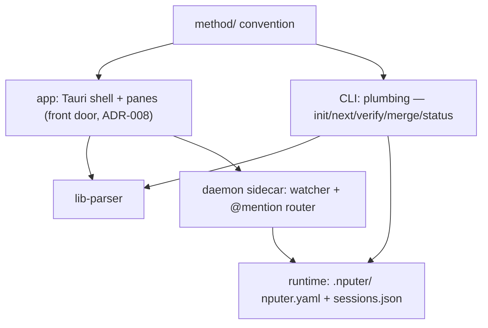

# Architecture

## System map

## Components
| ID | Component | Responsibility | Depends on | Status |
|----|-----------|----------------|------------|--------|
| C-01 | method/ | The convention: templates, formats, roles, interviews | — | built (v0.1.4) |
| C-02 | CLI | Plumbing + power/CI path (ADR-008): genesis, dispatch; shells out to agent CLIs | C-01, C-06 | planned |
| C-03 | Runtime | nputer.yaml role defaults; sessions.json registry | C-02 | planned |
| C-04 | Daemon | Sidecar: watcher, websocket, @mention → headless turns | C-02, C-03 | planned |
| C-05 | App | Front door (ADR-008): Tauri shell + panes over files; hosts the milestone-1 watcher (T-003); see docs/design/dashboard.md | C-01, C-06; C-07 when F-06 lands | building (milestone-1 surfaces complete — shell, watcher, board, detail, picker, design language T-001/003/004/005/006/007; map pane pending T-012) |
| C-06 | lib-parser | Pure library: docs/tasks/ + ROADMAP backbone → typed model (T-002); browser-safe pure exports (T-003); component files (T-008) | C-01 | verified |
| C-07 | nputer-index | Rust crate + small binary: code → docs/architecture/graph.json (tree-sitter TS/JS/Rust); deterministic, no tauri dependency (ADR-014/015); F-06 | — | planned |

Task `touches:` slugs map here: `app-shell` = C-05 shell/window/watcher
plumbing · `app-board` = C-05 board pane · `app-map` = C-05 map pane
(F-06) · `lib-parser` = C-06 · `crate-index` = C-07.

Component intent files: docs/architecture/components/ (same
C-namespace, one file per mapped component; parsed by C-06 — T-008,
ADR-014/015).

## Interfaces
- Everything coordinates through files; no component holds project
  state the files don't. Killing anything is safe by construction.
- CLI ↔ agents: spawn/resume the user's own agent CLIs with role
  prompts from method/roles/; never call model APIs directly.
- App ↔ project: read-only first; writes are single-field
  frontmatter edits or thread appends, nothing else (pure-lens rule).
- Code layout: `app/` = C-05 (Tauri 2 + React + Vite + Tailwind/shadcn;
  areas app-shell, app-board, app-map) · `lib/parser/` = C-06,
  self-contained package · `app/src-tauri/crates/nputer-index` = C-07
  (Cargo workspace inside app/src-tauri arrives with T-009 — the Rust
  sibling of ADR-011). Each package owns its package.json; app depends
  on @nputer/parser via file:../lib/parser (T-003; parser builds before
  app — ADR-011); no root workspace until a third npm package forces
  one. docs/ stays the brain.
- Map data (F-06): C-07 writes docs/architecture/graph.json —
  committed, deterministic, volatile-field-free (ADR-014); intent =
  docs/architecture/components/*.md parsed by C-06 (same C-namespace
  as this table); derivation is pure TS inside C-05 (ADR-015);
  delivery rides the docs watcher (collector gains .json under
  docs/architecture/; its 1 MiB cap governs the indexer's size
  budget).

## Related decisions
decisions/001–016. 007 (stack) and 008 (app-first) shape the map
above; 008 supersedes the original dashboard-last build order; 011
fixes the app → parser wiring (file: dep, no root workspace yet);
012 keeps native OS surfaces Rust-side (webview grant set stays
empty); 013–015 charter the architecture map (intent+reality v1,
committed deterministic graph files, indexer-Rust/derivation-TS).
