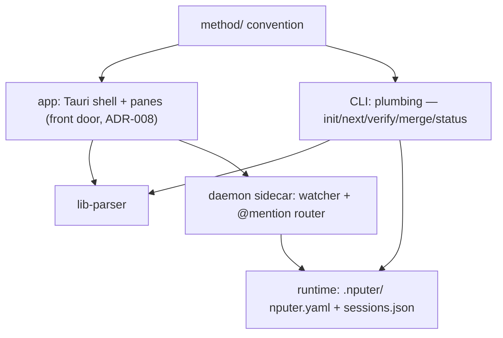

# Architecture

## System map

## Components
| ID | Component | Responsibility | Depends on | Status |
|----|-----------|----------------|------------|--------|
| C-01 | method/ | The convention: templates, formats, roles, interviews | — | built (v0.1.5) |
| C-02 | CLI | Plumbing + power/CI path (ADR-008): genesis, dispatch; shells out to agent CLIs | C-01, C-06 | planned |
| C-03 | Runtime | nputer.yaml role defaults; sessions.json registry | C-02 | planned |
| C-04 | Daemon | Sidecar: watcher, websocket, @mention → headless turns | C-02, C-03 | planned |
| C-05 | App | Front door (ADR-008): Tauri shell + panes over files; hosts the milestone-1 watcher (T-003); see docs/design/dashboard.md | C-01, C-06; C-07 when F-06 lands | building (board + map panes complete T-001…T-012; T-026 landed the genesis front door and the full-bleed `genesis` screen, and T-037 mounted C-13's lens inside it — the screen renders the pane on the watched `DocsModelState`, behind an error boundary, so hand-driven genesis renders live; T-025 registered C-14's four genesis commands + the exit-reap hook in lib.rs, so the shell can now spawn the planner although nothing in the UI calls it yet; T-049 moved the app's keyboard surface out of a component and up to the root — `components/shell/accelerators.ts` holds a pure chord table and ONE window listener mounted by `App`, replacing the front-door-scoped one, so ⌘O/⌘N fire from every screen — and gave the board header its own "Start an interview", so genesis is reachable from an open project and not only from the front door; T-050 made the startup handshake RECOVERABLE — the `docs-changed` subscribe + `docs_snapshot` pull that C-10 delivers is latched on the in-flight PROMISE rather than a boolean set before the awaits, so a refused boundary call no longer strands the app permanently, the rejection becomes shell state and is rendered as text, and the startup screen carries retry + the front door's own two ways in, which means no reachable screen is a dead end; T-034 gave the map pane its SECOND lens — a segmented control (architecture · tasks) where tasks lays the board's cards out in dependency waves over `blocked_by`, with a critical path, and the architecture lens is proven byte-unchanged beside it (the whole `map-view` delta is the 472-byte control element); T-042 made the genesis switch TRUTHFUL at the three places it was claiming more than it knew — the outcome now carries the docs tree it found (so the screen stops saying "nothing written yet" over a non-empty docs/), a watch-state transition is ONE measured rule covering armed→unarmed as well as unarmed→armed instead of two special cases, and the `model-updated` echo reads PROVENANCE (`outcomeCarriesSnapshot`) instead of a seq guard that was always true; T-027 turned the `genesis` SCREEN into a SPLIT VIEW and made C-05 the first caller of C-14 — `GenesisScreen.tsx` now lays a 640px chat column (C-13's `InterviewChat`) beside the lens above 1024px CSS px and centres the chat alone below it, `App.tsx` starts C-13's turn subscription at the root, and the screen owns a scoped accelerator table entry (⌘. cancels) on T-049's single window listener rather than a second one. The shell adds no reducer: the turn stream stays C-14's and the chat renders `turn.text` as the store folds it; T-051 then made that split the size the app actually opens at — `tauri.conf.json`'s window block goes 800×600 with no floor to **1280×840 with minWidth 1024 / minHeight 700**, the FIRST window minimum this shell has ever declared, so the sub-1024 "chat alone" branch above is now outside the window's legal range rather than its default (1280 is the unique width at which the two halves are equal; 700 clears every screen's natural content at the minimum, the repo map's 692 being the tallest, by 8px). The whole change is four manifest keys: no grant, no Rust, no frontend edit; rooms/sessions pending F-05) |
| C-06 | lib-parser | Pure library: docs/tasks/ + ROADMAP backbone → typed model (T-002); browser-safe pure exports (T-003); component files (T-008); cross-ref validation (T-019); strictness pass (T-030 — the backbone scanner strips HTML comments before matching, so a commented row is neither a phantom feature nor a dropped one; blocked_by cycles reported once per SCC; three new issue kinds, additive, consumed generically); id-space aliasing lifted OUT of the component registry and applied to all three id spaces (T-053, promoting T-030-s3 — `id-slot.ts` holds the numeric-slot grouping ONCE and component.ts, validate.ts and roadmap.ts each own only their message, because copied logic in three id spaces is three chances to disagree about what an id is. `C-05`/`C-005`, `T-01`/`T-001` and `F-1`/`F-01` are each one slot spelled twice, and nothing rejected the pair before: the strings differ, so `duplicate-id` correctly stayed silent while every consumer reasoning NUMERICALLY resolved the tie by an accident of zero-padding. Two properties are load-bearing — the strip is TEXTUAL and never `Number()`, so two genuinely different ids past 2^53 cannot false-alias when floating point runs out of room; and every digit run is canonicalized separately with its separators kept, so a task's `-sN` suffix aliases like any other digits while the `-s` keeps a suggestion apart from its parent. `aliased-id` gained a REQUIRED `space` field rather than splitting into three kinds — the shape `dangling-reference` and `duplicate-id` already use, and the one that breaks the compiler at a construction site instead of falling silently through an exhaustive switch. Zero app-side change: the app surfaces the new issues through the existing count, which is a premise the task VERIFIED rather than assumed) | C-01 | verified |
| C-07 | nputer-index | Rust crate + a REAL binary since T-014: code → docs/architecture/graph.json (tree-sitter TS/JS/Rust); deterministic, no tauri dependency (ADR-014/015). The binary now gates and reads as well as writes — `index [--root .]`, `index --check` (writes nothing; exits non-zero on a stale graph and prints WHAT moved), `index --watch` (headless, debounced 250 ms), `arch` and `arch drift [--fail-on undeclared\|unmapped\|any]` (read the COMMITTED graph, one record per line) — on ONE exit-code contract shared with `npm run boot:check`: 0 clean · 1 the gate's verdict · 2 called wrong · 3 could not run, so "stale" and "could not tell you" are never the same number. `arch`/`arch drift` carry a NARROW reality-side join in Rust; see ADR-015's dated addendum for what that may do and where it can still disagree. F-06 | — | building (TS/JS extraction + committed graph done T-009; the binary, `--check`, `--watch` and the arch reports done T-014; Rust language extraction T-010 still open — milestone 4) |

Task `touches:` slugs map here: `app-shell` = C-05 shell/window/watcher
plumbing · `app-board` = C-05 board pane · `app-map` = C-05 map pane
(F-06) · `app-interview` = C-13 genesis pane (F-03) · `app-agent` =
C-14 agent runner (F-03) · `lib-parser` = C-06 · `crate-index` = C-07.

Component intent files: docs/architecture/components/ (same
C-namespace, one file per mapped component; parsed by C-06 — T-008,
ADR-014/015).

## Interfaces
- Everything coordinates through files; no component holds project
  state the files don't. Killing anything is safe by construction.
- CLI ↔ agents: spawn/resume the user's own agent CLIs with role
  prompts from method/roles/; never call model APIs directly.
- App ↔ project: read-only first; writes are single-field
  frontmatter edits or thread appends, nothing else (pure-lens rule).
- Genesis: the spawned planner session is the writer; the app renders
  what lands (ADR-017); app-side writes confined to .nputer/ runtime
  files. Entry is two zero-argument Tauri commands (T-026, the ADR-012
  pattern — the native dialog opens Rust-side and no path crosses IPC
  in either direction); a folder that already holds a plan is routed to
  the ordinary open, so no overwrite path exists by construction. "No
  plan" is a WEAKER condition than "no docs/", and since T-042 the
  switch says so rather than assuming the strong one: a genesis folder
  may already hold a plain `docs/` — a lone `docs/ARCHITECTURE.md`, a
  `docs/decisions/` tree, any repo whose docs/ predates nputer — and
  when it does the ordinary recursive watch arms over it and the
  outcome CARRIES that tree, as an optional `DocsSnapshot` stamped with
  the switch's own `seq`, so the pane renders what is actually there
  instead of claiming nothing is written. `None` means the folder
  genuinely has no docs/ yet — the one shape the variant used to
  assume. Nothing new crosses the boundary: it is the same snapshot
  type, collector and containment rules the `docs-changed` channel has
  carried since T-003, on a second carrier. The tree is collected AFTER
  the arming rendezvous acks, and that ORDER is load-bearing rather
  than incidental (`open_as_project`'s own rule since T-007): arming
  resets the emit baseline to the tree it saw, so a snapshot read
  before the arm would miss a file written in the gap, and that file —
  present in the baseline, absent from the snapshot — would collect
  equal and stay suppressed until the next unrelated change. The
  arming thread reports whether a plain `docs/` armed, because it is
  the only place that knows for certain; the caller does not re-stat
  and guess across the validate→arm window. The
  rendering half is real since T-037: the `genesis` screen hands its
  live `DocsModelState` straight to C-13's pane, so the lens updates on
  C-10's existing watcher path — no new IPC, no polling, no prop
  plumbing. The pane is on the shell's critical path, so the mount
  wraps it in an error boundary that does NOT latch (it resets on the
  next snapshot's seq): a throwing pane degrades to a read-only notice
  inside the slot and cannot take the window down. The SPAWNING half is
  real since T-025 (C-14): four app commands — `genesis_start`,
  `genesis_send_turn(text)`, `genesis_status`, `genesis_cancel` — over
  one `genesis-turn` event channel, still exactly `core:default` (the
  92-grant set is byte-identical; `std::process` is not a plugin). One
  short-lived child per turn, resumed by the CLI's own native session
  id, cwd = the open project, argv fixed arrays and the user's text on
  stdin (never a shell string, never in argv); the child's environment
  is BUILT, not inherited — `env_clear()` plus a named allowlist, so no
  key or token can reach it (ADR-003 made mechanical). The `.nputer/`
  runtime writes are no longer planned but real and losable by charter:
  `sessions.json`, `genesis/transcript.jsonl`, and the compiled-in
  method snapshot materialized per genesis into `genesis/kit/` so the
  CLI reads it inside its own cwd scope — all outside the docs watch
  root, so they raise no snapshots. **Since T-027 the UI calls all of
  it**, and the shape of that call is the part worth recording: C-13's
  chat subscribes to the `genesis-turn` channel and invokes the four
  commands, and it adds NO second reduction — `reduceGenesisEvent`
  already coalesces deltas into `turn.text` and replaces the buffer with
  the canonical `result` on `completed`, so the chat renders what the
  store gives it and there is exactly one fold of that channel in the
  app. The BANKED CHIPS are the other half of the contract and they do
  not ride this channel at all: they are derived by diffing the docs
  snapshot C-10's watcher delivers across turn boundaries, so a chip is
  evidence that a FILE changed and can never be evidence that a model
  said so — driven with 24 hostile probes at T-027's verification,
  including turn text and activity labels naming real paths over an
  unchanged disk (zero chips) and a human writing a file mid-interview
  (an identical chip, which is ADR-006's hand-driven mode rendering
  correctly). What is STILL not true: the loop has never run against a
  real model — it is proven against a fake CLI fixture and a scripted
  lane only — and the user's half of the transcript does not survive a
  remount, because `refreshGenesisStatus` rebuilds phase/turn/session but
  never `turns` (T-029's rehydration).
- Resolving the agent CLI (disk → `execve`) — the boundary the Genesis
  bullet above does not describe, and since T-047 the one with a gate
  on it. Before any turn can spawn, `resolve_cli` decides WHICH
  `claude` runs, and it reads that from a file OUTSIDE the project:
  `agent-paths.json` in the app config dir — the app's only durable
  state that is not under `.nputer/`, so the `.nputer/` list above is
  not the whole disk footprint. It is read live at both doors
  (`start_genesis` and `send_turn`), i.e. re-judged before EVERY turn
  rather than trusted once. What T-047 changed is that its contents
  are no longer believed: a cached path is validated — absolute, no
  `.`/`..` component, file name == the adapter's binary, executable —
  BEFORE `Command::new` and before the `--version` probe, and a
  failure discards the entry, says so on stdout with the refused path
  sanitized, then falls through to a fresh probe and to typed
  `cliNotFound`; never a silent fallback to the poisoned value. The
  cached login `PATH` is GONE rather than gated: the field no longer
  exists on the struct, so a planted value still parses and is
  structurally unreachable, and the child's PATH is re-probed per
  resolve instead. That arm was chosen by measurement, not taste (a
  login-shell probe is 4.8–7.7 ms against the 41–57 ms
  `claude --version` the same resolve already paid), and it means a
  turn is not one process: the turn's own child is still exactly one,
  and the resolve ahead of it spawns a login shell and a version
  probe. Note what that probe reads: the CHILD's environment is still
  built rather than inherited (the `env_clear()` claim above is
  unchanged and still true), but the RESOLVER reads the app's own
  environment — `$SHELL` picks the program run with `-l -c`, and the
  fallback arm reads `PATH` — so "nothing is read from the
  environment" is true of `RunnerConfig` and false of the two
  functions beside it (T-047-s4). TWO honest residuals, both filed and
  both recorded in the validator's own header: the gate checks SHAPE
  and never identity, so an absolute traversal-free file named
  `claude` still passes (there is no `canonicalize`, so a symlink or a
  swapped file is enough, and no race is needed — T-047-s1), and the
  FRESHLY-PROBED path is exempt
  from the gate the cached one must pass, which leaves two doors
  holding one standard between them (T-047-s5).
- Test surfaces (DEV, browser-only) — part of what the app exposes, so
  named here rather than left to be discovered in the source. THREE
  harnesses hang off `window` in a browser DEV build since T-027 added
  `__nputerInterviewHarness` (it feeds `genesis-turn` events to the chat,
  which a served bundle cannot otherwise reach because there is no Tauri,
  therefore no runner and no CLI). It sits behind the SAME single gate as
  the two below — `!isTauri && import.meta.env.DEV` — and T-027's
  verification re-derived both halves of that gate against a DEV-flipped
  build: `NODE_ENV=development npm run build` does put all three names in
  the bundle (T-041-s4's known, already-filed lever, not a T-027
  regression), and the runtime `isTauri` half still holds inside that very
  bundle, checked at the minified install site. The two older ones:
  `__nputerDocsHarness` (pre-existing — feeds docs snapshots, which in a
  browser always land on phase `open`) and, since T-041,
  `__nputerShellHarness` (`applyProjectStatus` / `applyPickOutcome` /
  `applyStartupFailure` / `getShell`), which reaches the four phases a
  served bundle otherwise could not — `noProject`, `noDocs`,
  `rejectedPick`, `genesis` — and, since T-050, one state that is NOT a
  phase: the `startupFailed` SCREEN, which rides `loading` in the
  shipped app and `browser` in a served bundle. That fourth door is
  `recordStartupFailure` itself, the module-private function the store's
  own two catches call when `listen` or `invoke` rejects, so the lane
  renders the shipped failure state rather than a lane-side imitation —
  and it closes a hole only this harness can close, because a browser
  awaits neither boundary call and so cannot fail a real startup. It
  hands out the shell's OWN reducers by reference, so the E2E lane
  drives shipped code instead of a parallel implementation. Those two sit
  behind ONE gate, not two that can drift: `!isTauri && import.meta.env.DEV`,
  the same block in `watcher-store.ts`; T-027's third installs itself from
  C-13 under the same two conditions, so the property is still one rule
  and not three. Keeping them in that module rather
  than a test-only one is deliberate and is the SMALLER surface — a
  separate module could only reach the module-private reducers and the
  live shell through NEW PRODUCTION EXPORTS on the store, which would
  exist whether or not a test imported them. This is not IPC: no Tauri
  command, no grant, nothing reachable from the packaged app, and the
  app/src export surface grew by exactly one line, an `interface` that
  is erased at build. Measured rather than asserted at T-041's merge:
  pristine main, main + T-041's picker extraction alone, and T-041's
  HEAD build to 442,052 / 442,069 / 442,069 bytes with the last two
  byte-identical, so the harness contributes ZERO bytes and its object
  provably never constructs — the whole production delta is a 17-byte
  function extraction. ONE lever is known and filed (T-041-s4):
  `--mode development` does not flip DEV, but an inherited
  `NODE_ENV=development` does, and `npm run build` is
  tauri.conf.json's `beforeBuildCommand`. The runtime `isTauri` half
  keeps the harness inert in the packaged app even then, and a bundle
  test reds on the next `npm test`.
- Code layout: `app/` = C-05 (Tauri 2 + React + Vite + Tailwind/shadcn;
  areas app-shell, app-board, app-map, and app-interview since T-024 —
  `app/src/genesis/**` is C-13's own territory inside the app package;
  T-026 mounted the shell's `genesis` SCREEN
  (`app/src/components/shell/GenesisScreen.tsx`, C-05) and T-037 mounted
  the LENS inside it — `GenesisScreen.tsx` imports `GenesisPane`, so the
  pane is in the shipped bundle and the graph carries the C-05→C-13
  source edge, both of which were measured absent before that merge.
  That import is a source dependency of the shell on a child component
  and is still UNDECLARED in the registry — deliberate, live drift the
  map shows and the architect rules on, and since T-027 it is no longer
  the only one on that pair: the shell also imports `InterviewChat` and
  `App.tsx` imports `interview-source.ts`, so C-05→C-13 carries ten file
  edges where it carried four. **T-027 also made C-13 a drift SOURCE for
  the first time** — it had been only a target — by adding two undeclared
  directions OUT of the genesis pane: C-13→C-14 (all four new modules
  read `agent-store.ts`, which is the runner's store and not the pane's)
  and C-13→C-05 (both chat components import `components/ui/button.tsx`,
  the first genesis-side use of a shared UI primitive). Neither was
  drained at the merge — an integrator regenerates, the ARCHITECT rules
  on the registry — and both are the architect's to declare or refuse;
  area app-agent since T-025,
  where `app/src-tauri/src/agent/**` (the runner's Rust core) plus
  `app/src/lib/agent-store.ts` (its TS mirror) are C-14's territory and
  `lib.rs` keeps only the four thin command wrappers and the exit hook,
  which are C-05's. Note for T-010: FOUR `.rs` files under
  `app/src-tauri/` are claimed by no component — `acl_pin.rs` and
  `index_cmd.rs` (pre-existing) and T-025's `src/bin/fake_agent.rs` and
  `tests/agent_runner.rs`. All four are invisible while the indexer is
  `languages: ["ts"]`; they become a live unmapped-territory question
  the moment Rust extraction lands) · `lib/parser/` = C-06,
  self-contained package · `app/src-tauri/crates/nputer-index` = C-07
  (Cargo workspace inside app/src-tauri arrives with T-009 — the Rust
  sibling of ADR-011) · `tools/e2e/` = the real-input E2E lane (T-020),
  dev tooling under no component — it drives the app from outside over
  HTTP, imports neither package, and is .nputerignored out of the map ·
  `.github/workflows/` = the one CI job (T-020), a thin invoker of the
  CONVENTIONS commands, dormant until the repo's first push. Each
  package owns its package.json; app depends on @nputer/parser via
  file:../lib/parser (T-003; parser builds before app — ADR-011); the
  third npm package arrived with T-020 and the ruling was revisited and
  REAFFIRMED — still no root workspace (ADR-011 addendum). docs/ stays
  the brain.
- Map data (F-06): C-07 writes docs/architecture/graph.json —
  committed, deterministic, volatile-field-free (ADR-014); intent =
  docs/architecture/components/*.md parsed by C-06 (same C-namespace
  as this table); derivation is pure TS inside C-05 (ADR-015);
  delivery rides the docs watcher (collector gains .json under
  docs/architecture/; its 1 MiB cap governs the indexer's size
  budget). Since T-034 that describes the map pane's FIRST lens, not
  all of it: the pane carries a lens control (architecture · tasks),
  and the TASKS lens reads NEITHER of the two sources above. It builds
  dependency waves out of the `blocked_by` edges C-06 already parses
  from docs/tasks/ — so the second lens needs no new data source, no
  new IPC and nothing from C-07, and it renders on a tree where
  graph.json is absent or stale. Both lenses are pure TS derivation
  over the same live `DocsModelState`; what differs is which half of
  the model they read. Lens choice is session-ephemeral view state
  (useState, the T-012 overlay precedent) until T-022 gives the pane a
  persisted view-state seam — T-034-s3 records that `lens` is the
  fourth member of that seam.
  Since T-014 the "derivation is pure TS" clause above needs ONE
  qualification, and it is recorded where decisions live rather than
  here: ADR-015 carries a dated addendum. The binary's `arch` /
  `arch drift` reports needed a reality-side join of their own, because
  a CLI cannot call into the app's TypeScript. It is deliberately a
  READER — no rollups, no task join, no provenance, and a registry
  reader that refuses (exit 3) rather than guesses — and it was diffed
  against the TS engine over identical inputs at **252 fact lines
  byte-identical** on the live registry. So derivation is still
  TypeScript and the map pane is unaffected. What is no longer true is
  the implicit promise that one engine means one answer: `registry.rs`
  strips quotes without processing YAML escapes where `@nputer/parser`
  processes them, so a `paths:` entry carrying an escape makes both
  engines exit 0 and disagree about ownership (T-014-s6 — latent, no
  live component file carries a trigger, and the close is three
  refusals rather than a second YAML parser).

## Related decisions
decisions/001–017. 007 (stack) and 008 (app-first) shape the map
above; 008 supersedes the original dashboard-last build order; 011
fixes the app → parser wiring (file: dep, no root workspace yet);
012 keeps native OS surfaces Rust-side (webview grant set stays
empty); 013–015 charter the architecture map (intent+reality v1,
committed deterministic graph files, indexer-Rust/derivation-TS);
017 settles genesis (spawned planner writes, app stays a lens —
supersedes ADR-008's Node-daemon-sidecar phrasing for the spawn
surface).
