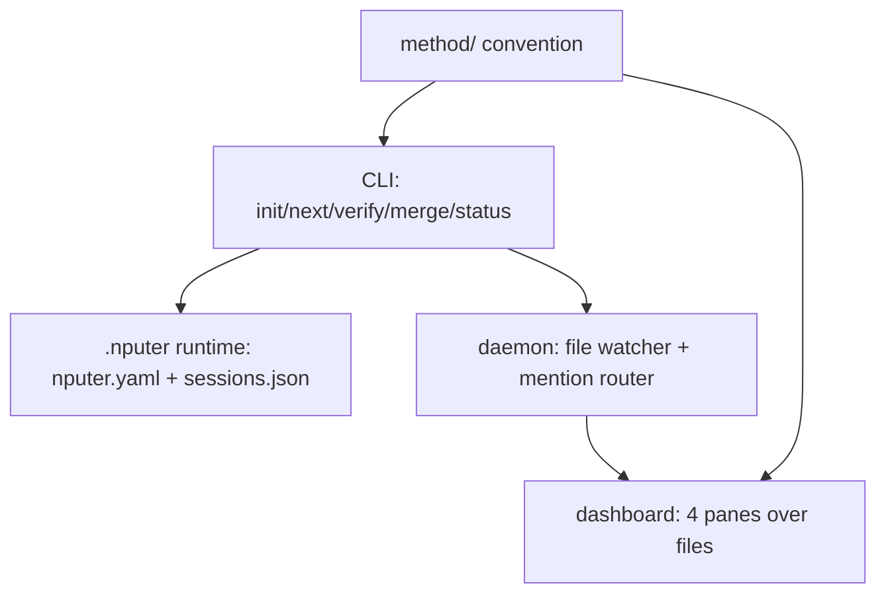

# Architecture

## System map

## Components
| ID | Component | Responsibility | Depends on | Status |
|----|-----------|----------------|------------|--------|
| C-01 | method/ | The convention: templates, formats, roles, interviews | — | built (v0.1.3) |
| C-02 | CLI | Genesis + choreography; shells out to agent CLIs | C-01 | planned |
| C-03 | Runtime | nputer.yaml role defaults; sessions.json registry | C-02 | planned |
| C-04 | Daemon | Watcher, websocket, @mention → headless turns | C-02, C-03 | planned |
| C-05 | Dashboard | Lens over files; see docs/design/dashboard.md | C-04 | planned |

## Interfaces
- Everything coordinates through files; no component holds project
  state the files don't. Killing anything is safe by construction.
- CLI ↔ agents: spawn/resume the user's own agent CLIs with role
  prompts from method/roles/; never call model APIs directly.
- Dashboard ↔ project: read-only first; writes are single-field
  frontmatter edits or thread appends, nothing else.

## Related decisions
decisions/001–006.
