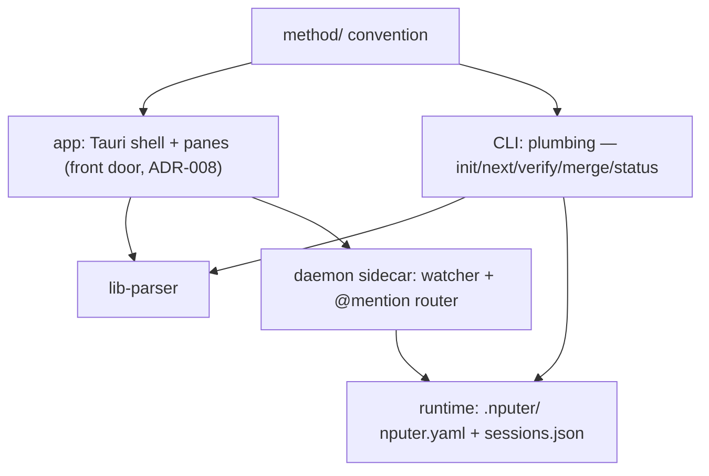

# Architecture

## System map

## Components
| ID | Component | Responsibility | Depends on | Status |
|----|-----------|----------------|------------|--------|
| C-01 | method/ | The convention: templates, formats, roles, interviews | — | built (v0.1.5) |
| C-02 | CLI | Plumbing + power/CI path (ADR-008): genesis, dispatch; shells out to agent CLIs | C-01, C-06 | planned |
| C-03 | Runtime | nputer.yaml role defaults; sessions.json registry | C-02 | planned |
| C-04 | Daemon | Sidecar: watcher, websocket, @mention → headless turns | C-02, C-03 | planned |
| C-05 | App | Front door (ADR-008): Tauri shell + panes over files; hosts the milestone-1 watcher (T-003); see docs/design/dashboard.md | C-01, C-06; C-07 when F-06 lands | building (board + map panes complete T-001…T-012; T-026 landed the genesis front door and the full-bleed `genesis` screen, and T-037 mounted C-13's lens inside it — the screen renders the pane on the watched `DocsModelState`, behind an error boundary, so hand-driven genesis renders live; T-025 registered C-14's four genesis commands + the exit-reap hook in lib.rs, so the shell can now spawn the planner although nothing in the UI calls it yet; T-027 still owes the split view's left half; rooms/sessions pending F-05) |
| C-06 | lib-parser | Pure library: docs/tasks/ + ROADMAP backbone → typed model (T-002); browser-safe pure exports (T-003); component files (T-008); cross-ref validation (T-019) | C-01 | verified |
| C-07 | nputer-index | Rust crate + small binary: code → docs/architecture/graph.json (tree-sitter TS/JS/Rust); deterministic, no tauri dependency (ADR-014/015); F-06 | — | building (TS/JS extraction + committed graph done T-009; Rust lang T-010, binary T-014 — milestone 4) |

Task `touches:` slugs map here: `app-shell` = C-05 shell/window/watcher
plumbing · `app-board` = C-05 board pane · `app-map` = C-05 map pane
(F-06) · `app-interview` = C-13 genesis pane (F-03) · `app-agent` =
C-14 agent runner (F-03) · `lib-parser` = C-06 · `crate-index` = C-07.

Component intent files: docs/architecture/components/ (same
C-namespace, one file per mapped component; parsed by C-06 — T-008,
ADR-014/015).

## Interfaces
- Everything coordinates through files; no component holds project
  state the files don't. Killing anything is safe by construction.
- CLI ↔ agents: spawn/resume the user's own agent CLIs with role
  prompts from method/roles/; never call model APIs directly.
- App ↔ project: read-only first; writes are single-field
  frontmatter edits or thread appends, nothing else (pure-lens rule).
- Genesis: the spawned planner session is the writer; the app renders
  what lands (ADR-017); app-side writes confined to .nputer/ runtime
  files. Entry is two zero-argument Tauri commands (T-026, the ADR-012
  pattern — the native dialog opens Rust-side and no path crosses IPC
  in either direction); a folder that already holds a plan is routed to
  the ordinary open, so no overwrite path exists by construction. The
  rendering half is real since T-037: the `genesis` screen hands its
  live `DocsModelState` straight to C-13's pane, so the lens updates on
  C-10's existing watcher path — no new IPC, no polling, no prop
  plumbing. The pane is on the shell's critical path, so the mount
  wraps it in an error boundary that does NOT latch (it resets on the
  next snapshot's seq): a throwing pane degrades to a read-only notice
  inside the slot and cannot take the window down. The SPAWNING half is
  real since T-025 (C-14): four app commands — `genesis_start`,
  `genesis_send_turn(text)`, `genesis_status`, `genesis_cancel` — over
  one `genesis-turn` event channel, still exactly `core:default` (the
  92-grant set is byte-identical; `std::process` is not a plugin). One
  short-lived child per turn, resumed by the CLI's own native session
  id, cwd = the open project, argv fixed arrays and the user's text on
  stdin (never a shell string, never in argv); the child's environment
  is BUILT, not inherited — `env_clear()` plus a named allowlist, so no
  key or token can reach it (ADR-003 made mechanical). The `.nputer/`
  runtime writes are no longer planned but real and losable by charter:
  `sessions.json`, `genesis/transcript.jsonl`, and the compiled-in
  method snapshot materialized per genesis into `genesis/kit/` so the
  CLI reads it inside its own cwd scope — all outside the docs watch
  root, so they raise no snapshots. What is NOT yet true: no UI calls
  any of it (T-027), and the loop has never run against a real model —
  it is proven against a fake CLI fixture only.
- Resolving the agent CLI (disk → `execve`) — the boundary the Genesis
  bullet above does not describe, and since T-047 the one with a gate
  on it. Before any turn can spawn, `resolve_cli` decides WHICH
  `claude` runs, and it reads that from a file OUTSIDE the project:
  `agent-paths.json` in the app config dir — the app's only durable
  state that is not under `.nputer/`, so the `.nputer/` list above is
  not the whole disk footprint. It is read live at both doors
  (`start_genesis` and `send_turn`), i.e. re-judged before EVERY turn
  rather than trusted once. What T-047 changed is that its contents
  are no longer believed: a cached path is validated — absolute, no
  `.`/`..` component, file name == the adapter's binary, executable —
  BEFORE `Command::new` and before the `--version` probe, and a
  failure discards the entry, says so on stdout with the refused path
  sanitized, then falls through to a fresh probe and to typed
  `cliNotFound`; never a silent fallback to the poisoned value. The
  cached login `PATH` is GONE rather than gated: the field no longer
  exists on the struct, so a planted value still parses and is
  structurally unreachable, and the child's PATH is re-probed per
  resolve instead. That arm was chosen by measurement, not taste (a
  login-shell probe is 4.8–7.7 ms against the 41–57 ms
  `claude --version` the same resolve already paid), and it means a
  turn is not one process: the turn's own child is still exactly one,
  and the resolve ahead of it spawns a login shell and a version
  probe. Note what that probe reads: the CHILD's environment is still
  built rather than inherited (the `env_clear()` claim above is
  unchanged and still true), but the RESOLVER reads the app's own
  environment — `$SHELL` picks the program run with `-l -c`, and the
  fallback arm reads `PATH` — so "nothing is read from the
  environment" is true of `RunnerConfig` and false of the two
  functions beside it (T-047-s4). TWO honest residuals, both filed and
  both recorded in the validator's own header: the gate checks SHAPE
  and never identity, so an absolute traversal-free file named
  `claude` still passes (there is no `canonicalize`, so a symlink or a
  swapped file is enough, and no race is needed — T-047-s1), and the
  FRESHLY-PROBED path is exempt
  from the gate the cached one must pass, which leaves two doors
  holding one standard between them (T-047-s5).
- Test surfaces (DEV, browser-only) — part of what the app exposes, so
  named here rather than left to be discovered in the source. Two
  harnesses hang off `window` in a browser DEV build:
  `__nputerDocsHarness` (pre-existing — feeds docs snapshots, which in a
  browser always land on phase `open`) and, since T-041,
  `__nputerShellHarness` (`applyProjectStatus` / `applyPickOutcome` /
  `getShell`), which reaches the four phases a served bundle otherwise
  could not — `noProject`, `noDocs`, `rejectedPick`, `genesis`. It hands
  out the shell's OWN reducers by reference, so the E2E lane drives
  shipped code instead of a parallel implementation. Both sit behind ONE
  gate, not two that can drift: `!isTauri && import.meta.env.DEV`, the
  same block in `watcher-store.ts`. Keeping them in that module rather
  than a test-only one is deliberate and is the SMALLER surface — a
  separate module could only reach the module-private reducers and the
  live shell through NEW PRODUCTION EXPORTS on the store, which would
  exist whether or not a test imported them. This is not IPC: no Tauri
  command, no grant, nothing reachable from the packaged app, and the
  app/src export surface grew by exactly one line, an `interface` that
  is erased at build. Measured rather than asserted at T-041's merge:
  pristine main, main + T-041's picker extraction alone, and T-041's
  HEAD build to 442,052 / 442,069 / 442,069 bytes with the last two
  byte-identical, so the harness contributes ZERO bytes and its object
  provably never constructs — the whole production delta is a 17-byte
  function extraction. ONE lever is known and filed (T-041-s4):
  `--mode development` does not flip DEV, but an inherited
  `NODE_ENV=development` does, and `npm run build` is
  tauri.conf.json's `beforeBuildCommand`. The runtime `isTauri` half
  keeps the harness inert in the packaged app even then, and a bundle
  test reds on the next `npm test`.
- Code layout: `app/` = C-05 (Tauri 2 + React + Vite + Tailwind/shadcn;
  areas app-shell, app-board, app-map, and app-interview since T-024 —
  `app/src/genesis/**` is C-13's own territory inside the app package;
  T-026 mounted the shell's `genesis` SCREEN
  (`app/src/components/shell/GenesisScreen.tsx`, C-05) and T-037 mounted
  the LENS inside it — `GenesisScreen.tsx` imports `GenesisPane`, so the
  pane is in the shipped bundle and the graph carries the C-05→C-13
  source edge, both of which were measured absent before that merge.
  That import is a source dependency of the shell on a child component
  and is still UNDECLARED in the registry — deliberate, live drift the
  map shows and the architect rules on; area app-agent since T-025,
  where `app/src-tauri/src/agent/**` (the runner's Rust core) plus
  `app/src/lib/agent-store.ts` (its TS mirror) are C-14's territory and
  `lib.rs` keeps only the four thin command wrappers and the exit hook,
  which are C-05's. Note for T-010: FOUR `.rs` files under
  `app/src-tauri/` are claimed by no component — `acl_pin.rs` and
  `index_cmd.rs` (pre-existing) and T-025's `src/bin/fake_agent.rs` and
  `tests/agent_runner.rs`. All four are invisible while the indexer is
  `languages: ["ts"]`; they become a live unmapped-territory question
  the moment Rust extraction lands) · `lib/parser/` = C-06,
  self-contained package · `app/src-tauri/crates/nputer-index` = C-07
  (Cargo workspace inside app/src-tauri arrives with T-009 — the Rust
  sibling of ADR-011) · `tools/e2e/` = the real-input E2E lane (T-020),
  dev tooling under no component — it drives the app from outside over
  HTTP, imports neither package, and is .nputerignored out of the map ·
  `.github/workflows/` = the one CI job (T-020), a thin invoker of the
  CONVENTIONS commands, dormant until the repo's first push. Each
  package owns its package.json; app depends on @nputer/parser via
  file:../lib/parser (T-003; parser builds before app — ADR-011); the
  third npm package arrived with T-020 and the ruling was revisited and
  REAFFIRMED — still no root workspace (ADR-011 addendum). docs/ stays
  the brain.
- Map data (F-06): C-07 writes docs/architecture/graph.json —
  committed, deterministic, volatile-field-free (ADR-014); intent =
  docs/architecture/components/*.md parsed by C-06 (same C-namespace
  as this table); derivation is pure TS inside C-05 (ADR-015);
  delivery rides the docs watcher (collector gains .json under
  docs/architecture/; its 1 MiB cap governs the indexer's size
  budget).

## Related decisions
decisions/001–017. 007 (stack) and 008 (app-first) shape the map
above; 008 supersedes the original dashboard-last build order; 011
fixes the app → parser wiring (file: dep, no root workspace yet);
012 keeps native OS surfaces Rust-side (webview grant set stays
empty); 013–015 charter the architecture map (intent+reality v1,
committed deterministic graph files, indexer-Rust/derivation-TS);
017 settles genesis (spawned planner writes, app stays a lens —
supersedes ADR-008's Node-daemon-sidecar phrasing for the spawn
surface).
