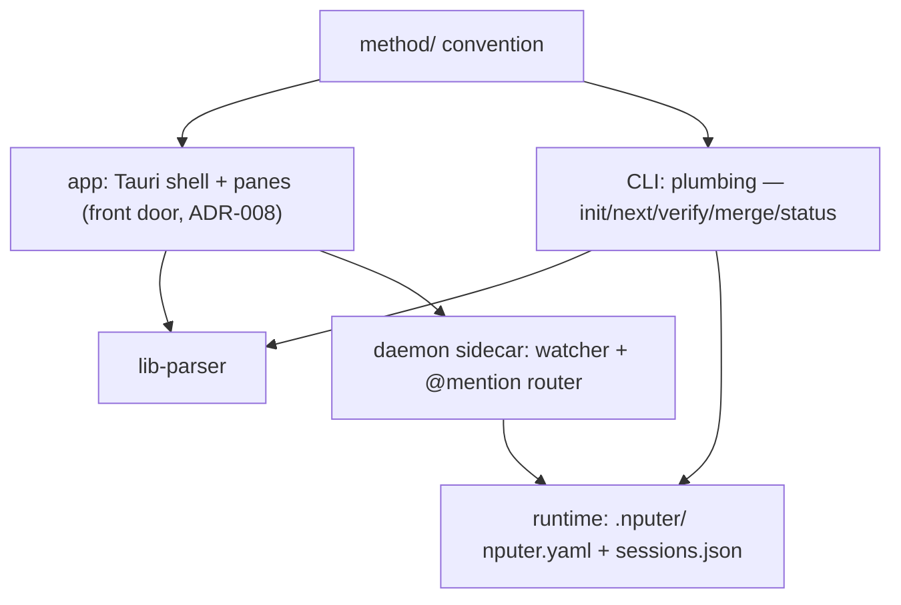

# Architecture

Compacted 2026-08-27 under ADR-019 (docs/rooms/governing-docs.md). The
contract: which components exist, what each owns, the interface rules —
one paragraph each, card ids carrying the stories. The per-merge
component chronicle this file used to hold (1,203 lines) is permanently
readable at `git show a6491e6:docs/ARCHITECTURE.md`; each component's
own file under docs/architecture/components/ is the registry the parser
reads, and the graph (docs/architecture/graph.json) is the reality
side. This file is touched only when an INTERFACE moves.

## System map

## Components

| ID | Component | Responsibility | Depends on | Status |
|----|-----------|----------------|------------|--------|
| C-01 | method/ | The convention: templates, formats, roles, interviews, docs-protocol | — | built (v0.1.8) |
| C-02 | CLI | Plumbing + power/CI path (ADR-008): genesis, dispatch; shells out to agent CLIs | C-01, C-06 | planned |
| C-03 | Runtime | nputer.yaml role defaults; sessions.json registry | C-02 | planned |
| C-04 | Daemon | Sidecar: watcher, websocket, @mention → headless turns | C-02, C-03 | planned |
| C-05 | App | Front door (ADR-008): Tauri shell + panes over files; hosts the docs watcher. History: the cards T-001…T-149 and `git show a6491e6` | C-01, C-06, C-07 | building |
| C-06 | lib-parser | Pure library: docs → typed model; browser-safe exports; owns the fence (`fence.ts`, T-134) and the id layer. History: the cards and `git show a6491e6` | C-01 | verified |
| C-07 | nputer-index | Rust crate + binary: code → committed graph (TS/JS/Rust); `index --check`, `arch`/`drift`/`cycles`/`blast`; depth-bounded (T-129); budget 1,040,000 bytes with a measured reason (T-139) — headroom derived with `index --check`, never quoted | — | building |

The component set is the REGISTRY, never this paragraph: one file per
component under docs/architecture/components/, parsed by C-06. **THE
IDS ARE NOT TRANSCRIBED HERE** — `ls docs/architecture/components/`
prints them at your own ref and each file's own `name:` is what it is
called; the table above stops at C-07 because the planned C-02/C-03/
C-04 have no registry file. The list that stood here was wrong three
ways at once (`T-127-s7`): it ended at C-16 while C-17 and C-18
existed, it called C-09 a model store when its field says Detail
panel, and it read as though the table's own components were outside
the registry. Declaring a component moves live-tree fixtures whose
COUNT IS NOT WRITTEN HERE either, and for the same reason — it has
been corrected twice already (`T-127-s1` finding 5, membership;
`T-127-s8` item 2, count). Ask the DOCS GATE with a registry path for
the suites owed at your ref, in CONVENTIONS' one spelling; that file's
DECLARING A COMPONENT gotcha still reads THREE and `T-127-s8` owns
its repair.

**THE SLUG MAP'S AUTHORITY IS EACH COMPONENT FILE'S OWN `touch_slugs:`
FIELD — read the field, never prose.** Two implementations compute it
(C-06's `slugPathIndex`, C-08's `expandTouch`), which is T-057's own
failure shape and `T-137` was the vehicle for unifying them. NO
component is claimed by two slugs today — T-163 (2026-08-30, @human's
ruling) took C-11's `touch_slugs:` to the empty list, so `app-board`
and `app-shell` expand disjoint; a tokens change enters a lane by its
own bare path. Derived mechanically from
`docs/architecture/components/C-*.md` at this compaction — and this
block is COMPARED against the fields by `brief.spec.ts` on every lane
run, so a component change that moves the fields reds it by name
rather than letting it go quietly stale:

    app-agent    -> C-14          app-interview -> C-13
    app-board    -> C-08, C-09, C-17, C-18   app-map  -> C-12
    app-dispatch -> C-15          app-shell     -> C-05, C-10, C-16
    crate-index  -> C-07          lib-parser    -> C-06

Component intent files: docs/architecture/components/ (same
C-namespace, one file per mapped component; parsed by C-06 — T-008,
ADR-014/015).

## Interfaces

- Everything coordinates through files; no component holds project
  state the files don't. Killing anything is safe by construction.
- CLI ↔ agents: spawn/resume the user's own agent CLIs with role
  prompts from method/roles/; never call model APIs directly.
- App ↔ project: read-only first; writes are single-field frontmatter
  edits or thread appends, nothing else (pure-lens rule).
- Genesis (ADR-017): the spawned planner session is the WRITER; the
  app renders what lands, and app-side writes are confined to
  `.nputer/` runtime files. Half of that rule is enforced by the type
  system: the app ships no `@types/node`, the write surface lives in a
  second tsc PROGRAM (`tsconfig.test.json`), and `npm run build`'s
  second `tsc` is the load-bearing gate (T-073). Entry is
  zero-argument Tauri commands — no path crosses IPC in either
  direction (ADR-012, T-026). Routing: a folder with a plan opens as a
  project, with ONE exception — a plan-holding folder whose OWN
  interview is RESUMABLE routes back to genesis (T-042, T-064, T-123;
  resumable means resumable, not present — the bool that couldn't say
  so cost a rejection). The runner (C-14) spawns one short-lived child
  per turn, argv fixed, text on stdin, environment BUILT
  (`env_clear()` + allowlist, ADR-003), eight zero-argument genesis
  commands over one event channel with one fold (T-025, T-029). Banked
  chips derive from the WATCHER seeing files, never from model claims
  (T-027); completion derives from typed state + a parseable board on
  disk, never a model-emitted marker (T-028). Failures reach the user
  as typed outcomes that never cost an affordance falsely — the
  denial/withdrawal/notice family is T-069/T-081/T-101/T-102/T-107/
  T-113's cards.
- Resolving the agent CLI (disk → execve): one fresh probe decides
  WHICH binary runs — no cache, no file (T-060 retired
  `agent-paths.json`). ONE gate holds every door
  (`validate_resolved_program`: absolute, traversal-free, correctly
  named, executable — shared by the `claude` and `git` doors, T-013),
  the resolver's three environment reads are named and pinned, and NO
  TEST CAN RESOLVE THE REAL CLI structurally (forbidden-by-default
  under cargo test and rustdoc, T-047-s6/T-060). The honest residual:
  the gate checks SHAPE, never identity — a symlink named `claude` on
  a writable PATH directory passes.
- Test surfaces (DEV, browser-only): three `window.__nputer*Harness`
  objects behind ONE gate (`!isTauri && import.meta.env.DEV`), handing
  out the shipped reducers by reference so the e2e lane drives real
  code; zero bytes in the production bundle, measured (T-041, T-027).
  The known lever: an inherited `NODE_ENV=development` flips DEV
  (T-041-s4); the runtime `isTauri` half holds regardless.
- Code layout: `app/` = C-05 (+ C-08/C-09/C-11/C-12/C-13/C-16/C-17/C-18
  territories in `app/src/`; C-14 owns `app/src-tauri/src/agent/**` +
  `agent-store.ts`; C-15 owns `app/src-tauri/src/dispatch/**`) ·
  `lib/parser/` = C-06, self-contained · `app/src-tauri/crates/
  nputer-index` = C-07 (workspace inside app/src-tauri) · `tools/e2e/`
  = the real-input lane + the docs-gate/token-lint/brief analysers,
  dev tooling under no component, `.nputerignore`d out of the map ·
  `.github/workflows/` = one CI job, a thin invoker of CONVENTIONS'
  commands, ENFORCING since the first push (2026-08-29; green end to
  end since run 33274798983). No root workspace (ADR-011,
  reaffirmed). docs/ stays the brain — and since T-084 the brain is a
  CODE INPUT: programs in all four packages read it, the DOCS GATE
  derives the reader set on every run, and no count of them is ever
  transcribed (ask `docs-gate.mjs --census`).
- Map data (F-06): three sources — INTENT (the registry, parsed by
  C-06), REALITY (the committed graph, written by C-07, delivered over
  the docs watcher), HISTORY (git, read live through `repo_churn`).
  Derivation is pure TS in C-05 (ADR-015; the binary's own narrow
  reality-side join is that ADR's dated addendum). Only HISTORY can be
  absent, so its segment DISABLES with a reason rather than vanishing;
  a source that REMEMBERS must say when it measured and be told when
  to forget — module-scope store subscription + a generation counter
  (T-116). Zoom and churn are T-013's; the tasks lens reads
  `blocked_by` waves and needs nothing from C-07 (T-034).

## Related decisions
decisions/001–019. 007 (stack) and 008 (app-first) shape the map
above; 011 fixes the app → parser wiring (file: dep, no root
workspace); 012 keeps native OS surfaces Rust-side (webview grant set
stays empty, pinned by acl_pin.rs); 013–015 charter the architecture
map (intent+reality v1, committed deterministic graph files,
indexer-Rust/derivation-TS); 017 settles genesis (spawned planner
writes, app stays a lens); 019 charters the governing documents
(rules/truths/records, budgets, docs/checkpoints/).
