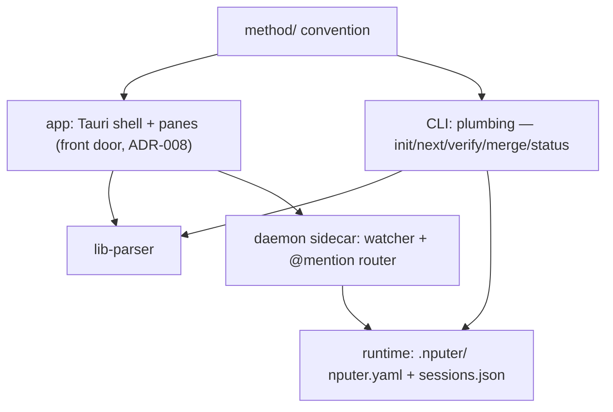

# Architecture

## System map

## Components
| ID | Component | Responsibility | Depends on | Status |
|----|-----------|----------------|------------|--------|
| C-01 | method/ | The convention: templates, formats, roles, interviews | — | built (v0.1.3) |
| C-02 | CLI | Plumbing + power/CI path (ADR-008): genesis, dispatch; shells out to agent CLIs | C-01, C-06 | planned |
| C-03 | Runtime | nputer.yaml role defaults; sessions.json registry | C-02 | planned |
| C-04 | Daemon | Sidecar: watcher, websocket, @mention → headless turns | C-02, C-03 | planned |
| C-05 | App | Front door (ADR-008): Tauri shell + panes over files; hosts the milestone-1 watcher (T-003); see docs/design/dashboard.md | C-01, C-06 | building (shell done T-001; board pending T-004–T-006) |
| C-06 | lib-parser | Pure library: docs/tasks/ + ROADMAP backbone → typed model (T-002) | C-01 | verified |

Task `touches:` slugs map here: `app-shell` = C-05 shell/window/watcher
plumbing · `app-board` = C-05 board pane · `lib-parser` = C-06.

## Interfaces
- Everything coordinates through files; no component holds project
  state the files don't. Killing anything is safe by construction.
- CLI ↔ agents: spawn/resume the user's own agent CLIs with role
  prompts from method/roles/; never call model APIs directly.
- App ↔ project: read-only first; writes are single-field
  frontmatter edits or thread appends, nothing else (pure-lens rule).
- Code layout: `app/` = C-05 (Tauri 2 + React + Vite + Tailwind/shadcn;
  areas app-shell, app-board) · `lib/parser/` = C-06, self-contained
  package. Each package owns its package.json; no root workspace until
  a task needs one (T-003 wires app → parser). docs/ stays the brain.

## Related decisions
decisions/001–008. 007 (stack) and 008 (app-first) shape the map
above; 008 supersedes the original dashboard-last build order.
