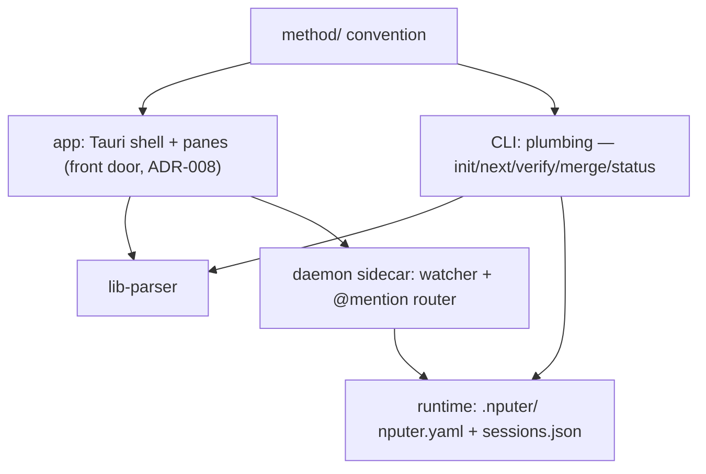

# Architecture

## System map

## Components
| ID | Component | Responsibility | Depends on | Status |
|----|-----------|----------------|------------|--------|
| C-01 | method/ | The convention: templates, formats, roles, interviews | — | built (v0.1.5) |
| C-02 | CLI | Plumbing + power/CI path (ADR-008): genesis, dispatch; shells out to agent CLIs | C-01, C-06 | planned |
| C-03 | Runtime | nputer.yaml role defaults; sessions.json registry | C-02 | planned |
| C-04 | Daemon | Sidecar: watcher, websocket, @mention → headless turns | C-02, C-03 | planned |
| C-05 | App | Front door (ADR-008): Tauri shell + panes over files; hosts the milestone-1 watcher (T-003); see docs/design/dashboard.md | C-01, C-06; C-07 when F-06 lands | building (board + map panes complete T-001…T-012; T-026 landed the genesis front door and the full-bleed `genesis` screen, and T-037 mounted C-13's lens inside it — the screen renders the pane on the watched `DocsModelState`, behind an error boundary, so hand-driven genesis renders live; T-027 still owes the split view's left half; rooms/sessions pending F-05) |
| C-06 | lib-parser | Pure library: docs/tasks/ + ROADMAP backbone → typed model (T-002); browser-safe pure exports (T-003); component files (T-008); cross-ref validation (T-019) | C-01 | verified |
| C-07 | nputer-index | Rust crate + small binary: code → docs/architecture/graph.json (tree-sitter TS/JS/Rust); deterministic, no tauri dependency (ADR-014/015); F-06 | — | building (TS/JS extraction + committed graph done T-009; Rust lang T-010, binary T-014 — milestone 4) |

Task `touches:` slugs map here: `app-shell` = C-05 shell/window/watcher
plumbing · `app-board` = C-05 board pane · `app-map` = C-05 map pane
(F-06) · `app-interview` = C-13 genesis pane (F-03) · `app-agent` =
C-14 agent runner (F-03) · `lib-parser` = C-06 · `crate-index` = C-07.

Component intent files: docs/architecture/components/ (same
C-namespace, one file per mapped component; parsed by C-06 — T-008,
ADR-014/015).

## Interfaces
- Everything coordinates through files; no component holds project
  state the files don't. Killing anything is safe by construction.
- CLI ↔ agents: spawn/resume the user's own agent CLIs with role
  prompts from method/roles/; never call model APIs directly.
- App ↔ project: read-only first; writes are single-field
  frontmatter edits or thread appends, nothing else (pure-lens rule).
- Genesis: the spawned planner session is the writer; the app renders
  what lands (ADR-017); app-side writes confined to .nputer/ runtime
  files. Entry is two zero-argument Tauri commands (T-026, the ADR-012
  pattern — the native dialog opens Rust-side and no path crosses IPC
  in either direction); a folder that already holds a plan is routed to
  the ordinary open, so no overwrite path exists by construction. The
  rendering half is real since T-037: the `genesis` screen hands its
  live `DocsModelState` straight to C-13's pane, so the lens updates on
  C-10's existing watcher path — no new IPC, no polling, no prop
  plumbing. The pane is on the shell's critical path, so the mount
  wraps it in an error boundary that does NOT latch (it resets on the
  next snapshot's seq): a throwing pane degrades to a read-only notice
  inside the slot and cannot take the window down.
- Code layout: `app/` = C-05 (Tauri 2 + React + Vite + Tailwind/shadcn;
  areas app-shell, app-board, app-map, and app-interview since T-024 —
  `app/src/genesis/**` is C-13's own territory inside the app package;
  T-026 mounted the shell's `genesis` SCREEN
  (`app/src/components/shell/GenesisScreen.tsx`, C-05) and T-037 mounted
  the LENS inside it — `GenesisScreen.tsx` imports `GenesisPane`, so the
  pane is in the shipped bundle and the graph carries the C-05→C-13
  source edge, both of which were measured absent before that merge.
  That import is a source dependency of the shell on a child component
  and is still UNDECLARED in the registry — deliberate, live drift the
  map shows and the architect rules on) · `lib/parser/` = C-06,
  self-contained package · `app/src-tauri/crates/nputer-index` = C-07
  (Cargo workspace inside app/src-tauri arrives with T-009 — the Rust
  sibling of ADR-011) · `tools/e2e/` = the real-input E2E lane (T-020),
  dev tooling under no component — it drives the app from outside over
  HTTP, imports neither package, and is .nputerignored out of the map ·
  `.github/workflows/` = the one CI job (T-020), a thin invoker of the
  CONVENTIONS commands, dormant until the repo's first push. Each
  package owns its package.json; app depends on @nputer/parser via
  file:../lib/parser (T-003; parser builds before app — ADR-011); the
  third npm package arrived with T-020 and the ruling was revisited and
  REAFFIRMED — still no root workspace (ADR-011 addendum). docs/ stays
  the brain.
- Map data (F-06): C-07 writes docs/architecture/graph.json —
  committed, deterministic, volatile-field-free (ADR-014); intent =
  docs/architecture/components/*.md parsed by C-06 (same C-namespace
  as this table); derivation is pure TS inside C-05 (ADR-015);
  delivery rides the docs watcher (collector gains .json under
  docs/architecture/; its 1 MiB cap governs the indexer's size
  budget).

## Related decisions
decisions/001–017. 007 (stack) and 008 (app-first) shape the map
above; 008 supersedes the original dashboard-last build order; 011
fixes the app → parser wiring (file: dep, no root workspace yet);
012 keeps native OS surfaces Rust-side (webview grant set stays
empty); 013–015 charter the architecture map (intent+reality v1,
committed deterministic graph files, indexer-Rust/derivation-TS);
017 settles genesis (spawned planner writes, app stays a lens —
supersedes ADR-008's Node-daemon-sidecar phrasing for the spawn
surface).
