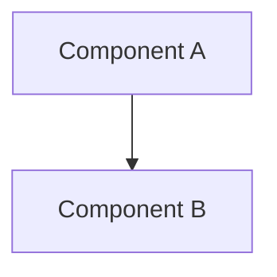

# Architecture

## System map
<!-- Keep this Mermaid current — the integrator updates it at checkpoint
     whenever a component, dependency, or interface changed. -->

## Components

| ID | Component | Responsibility | Depends on | Status |
|----|-----------|----------------|------------|--------|
| C-01 | <name> | <one line> | — | planned |

<!-- Status: planned / built / verified. The dashboard colors the map from
     this column plus the tasks that reference each component. -->

## Interfaces
<!-- The contracts between components that tasks must not break.
     Anything an executor could plausibly violate without noticing. -->

## Related decisions
<!-- Link ADRs that constrain the architecture: decisions/00X-*.md -->
